*Introduction_to_Input/Output*

Chapter 4 objectives are to:
    Describe the parallel ports on the LM3S/TM4C family
    Present the SysTick timer
    Describe the system clocks
    Write software to input from switches and output to LEDs
    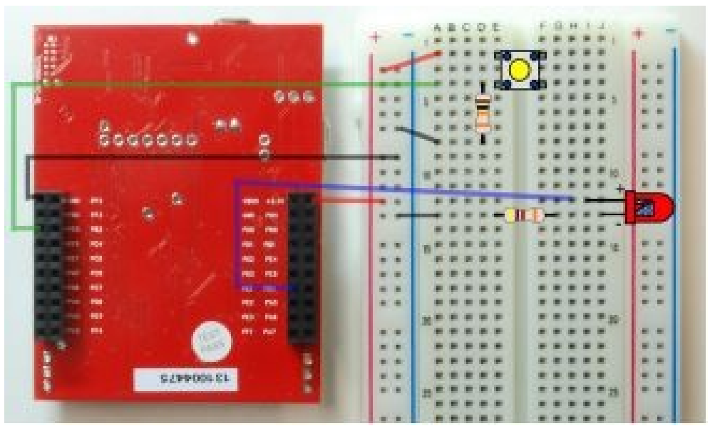
    Present some practical tips for debugging

Our first input/output interfaces will use the parallel ports or GPIO, allowing us to exchange digital information with the external world.
The second technique we will learn is to control time. 
    We can select the execution speed of the microcontroller using the phase-lock-loop, and we can perform time delays using the SysTick timer.

==============================================================================
                                  *Texas Instruments Microcontroller I/O pins*

In this section, we present the I/O pin configurations for the LM3S1968, TM4C123 and TM4C1294 microcontrollers.
The regular function of a pin is to perform parallel I/O, described later in Section 4.4.
Most pins, however, have one or more alternative functions.
    For example, port pins PA1 and PA0 can be either regular parallel port pins or an asynchronous serial port called universal asynchronous receiver/transmitter (UART).
    I/O pins on Cortex-M microcontrollers have a wide range of alternative functions:
        UART        Universal asynchronous receiver/transmitter
            The UART can be used for serial communication between computers.
            It is asynchronous and allows for simultaneous communication in both directions.
        SSI         Synchronous serial interface
            The SSI is alternately called serial peripheral interface (SPI). 
            It is used to interface mediumspeed I/O devices.
                In this book, we will use it to interface a graphics display
                In Volume 2 we use SSI to interface a digital to analog converter (DAC). 
                In Volume 3 we use it with a secure digital card (SDC).
        I2C         Inter-integrated circuit
            I2C is a simple I/O bus that we will use to interface low speed peripheral devices.
        Timer       Periodic interrupts, input capture, and output compare
        PWM         Pulse width modulation
             Input capture and output compare will be used to create periodic interrupts and measure period, pulse width, phase, and frequency.
             PWM outputs will be used to apply variable power to motor interfaces. 
             In a typical motor controller, input capture measures rotational speed, and PWM controls power. 
             A PWM output can also be used to create a DAC.
        ADC         Analog to digital converter, measure analog signals
             The ADC will be used to measure the amplitude of analog signals and will be important in data acquisition systems. 
        Analog      Comparator Compare two analog signals
             The analog comparator takes two analog inputs and produces a digital output depending on which analog input is greater.
        QEI         Quadrature encoder interface
             The QEI can be used to interface a brushless DC motor.
        USB         Universal serial bus
             USB is a high-speed serial communication channel.
        Ethernet    High-speed network
             The Ethernet port can be used to bridge the microcontroller to the Internet or a local area network.
        CAN         Controller area network
             The CAN creates a high-speed communication channel between microcontrollers and is commonly found in automotive and other distributed control applications. 
             The advanced topics of USB Ethernet and CAN are covered in Volume 3.
Joint Test Action Group (JTAG), standardized as the IEEE 1149.1, is a standard test access port used to program and debug the microcontroller board.
    Each microcontroller uses Port C pins 3,2,1,0 for the JTAG interface.
    Common Error: Even though it is possible to use the four JTAG pins as general I/O, debugging most microcontroller boards will be more stable if these four pins are left dedicated to the JTAG debugger.

Observation: The expression mixed-signal refers to a system with both analog and digital components. 
Notice how many I/O ports perform this analog↔digital bridge: ADC, DAC, analog comparator, PWM, QEI, input capture, and output compare.

==============================================================================
                                        *Texas Instruments LM3S1968 I/O pins*

Figure draws the I/O port structure for the LM3S1968 microcontroller.
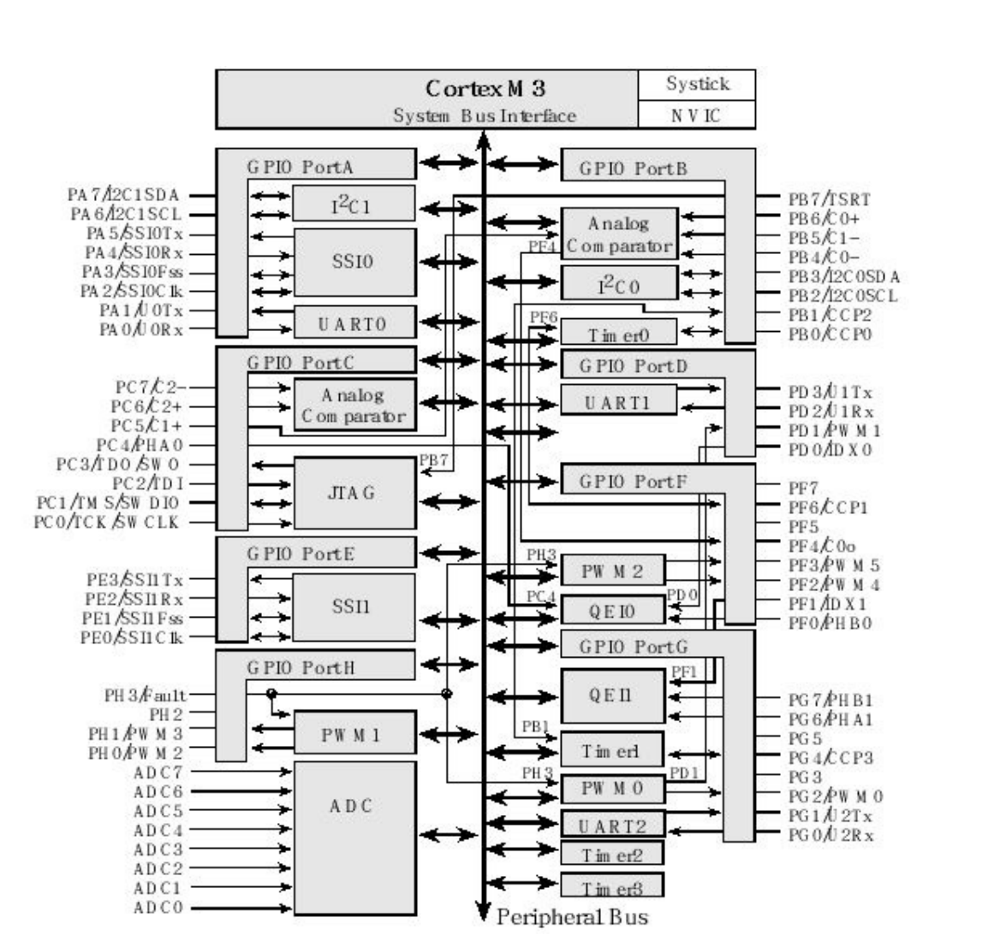
Most pins have two names: the port pin (PA0) and the alternate function name (U0Rx).
    However, pins PF5, PF7, PG3, PG5, and PH2 have no alternate function. 
Because the I/O ports are connected to the system bus interface, the microcontroller can perform I/O bus cycles simultaneous with instruction fetches from flash ROM. 
The LM3S1968 has 3 UART ports, 2 SSI ports, 2 I 2C ports, a 10-bit ADC, 6 PWM outputs, 4 timer input capture/output compare pins, 2 quadrature encoder interfaces, and three analog comparators. 
The ADC can sample up to 1 million times per second. 
There are 52 digital I/O lines and 8 ADC inputs. 
Table lists the regular and alternate names of the port pins.
    Regular         Alternate Pin Name          Alternate Function
    PA0 – PA1       U0RX, U0TX                  Universal Asynchronous Receiver/Transmit, UART0
    PA2 – PA5       S0CLK, S0FS, S0RX, S0TX     Synchronous Serial Interface, SSI0
    PA6 – PA7       SCL1, SDA1                  Inter-Integrated Circuit, I2C1
    PB0             CCP0                        Timer 0A Capture/Compare
    PB1             CCP2                        Timer 1A Capture/Compare
    PB2 – PB3       SCL0, SDA0                  Inter-Integrated Circuit, I2C0
    PB4, PB6, PF4   C0-, C0+, C0o               Analog Comparator 0
    PB5, PC5        C1-, C1+                    Analog Comparator 1
    PB7, PC0 – PC3  TRST, TCLK, TMS, TDI, TDO   JTAG Debugger
    PC4, PF0, PD0   PHA0, PHB0, IDX0            Quadrature Encoder Interface, QEI0
    PC6, PC7        C2+, C2-                    Analog Comparator 2
    PD2 – PD3       U1RX, U1TX                  Universal Asynchronous Receiver/Transmit, UART1
    PE0 – PE3       S1CLK, S1FS, S1RX, S1TX     Synchronous Serial Interface, SSI1
    PF2, PF3        PWM4, PWM5                  Pulse Width Modulator 2 PF6 CCP1 Timer 0B Capture/Compare
    PG0 – PG1       U2RX, U2TX                  Universal Asynchronous Receiver/Transmit, UART2
    PG2, PD1        PWM0, PWM1                  Pulse Width Modulator 0 PG4 CCP3 Timer 1B Capture/Compare
    PG6, PG7, PF1   PHA1, PHB1, IDX1            Quadrature Encoder Interface, QEI1
    PH0, PH1        PWM2, PWM3                  Pulse Width Modulator 1 PH3 Fault Hold all PWM outputs in safe state
Figure shows a Texas Instruments evaluation kit for the LM3S1968. 
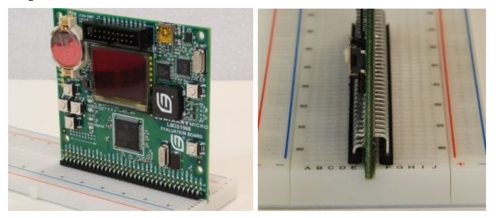
There are five switches and one LED on the board, see Figure. 
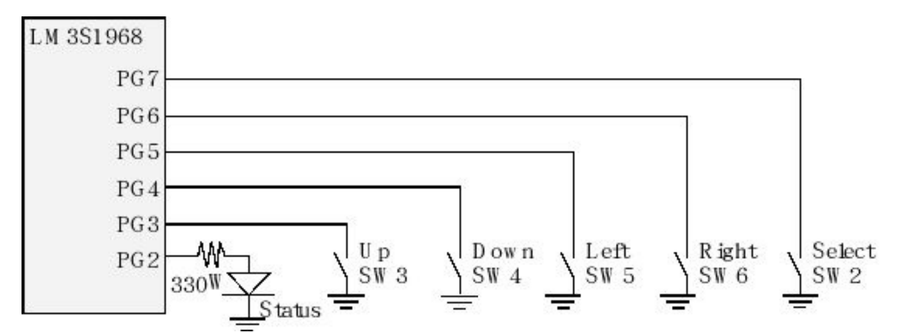
The part numbers for these kits are EKK-LM3S1968, EKI-LM3S1968, EKC-LM3S1968, EKT-LM3S1968, and EKSLM3S1968. 
    The different versions specify which compiler is included on the CD in the kit.
Observation:To use the switches on the LM3S1968 board you need to activate the internal pull-up resistors for the port, set bits 3 – 7 in GPIO_PORTG_PUR_R.
Observation: The switches on the LM3S1968 board are negative logic.

There are a number of possibilities for designing prototype systems using evaluation kits. 
    One option is to solder individual wires to pins as needed. 
        This approach is simple and reliable. It is appropriate if the kit is being used for one application and the choice of pins is unlikely to change. 
        The disadvantage is changing pins requires unsoldering and resoldering.
    A second approach is to solder a female socket onto the evaluation kit. 
        To connect a pin to your external circuit, you place a solid wire into the socket.
        This method is convenient if you plan to move wires as the design changes. 
        After a long period, the female socket can wear out or the ends of wires may break off inside the socket.
        Changing the socket is very difficult.
    A third approach is illustrated in Figure. 
        The breadboard interface was built using Samtec TSW-133-09-L-S-RE and TSW-133-08-L-S-RA connectors. 
        Right-angle male-male headers are soldered to the board in such a way that the male pins can be inserted into a standard solderless breadboard. 
        This approach is convenient if you are prototyping on a solderless breadboard. 
        This configuration is extremely robust and can withstand multiple insertions and extractions. 
        Push straight down to insert the board into the breadboard. 
        To remove the board, use two small screwdrivers and wedge between the board and the breadboard on each side a little at a time. 
        To assemble this interface, it may be helpful to separately insert each unsoldered header into the breadboard to hold it in place while it is being soldered. 
        If the spacing between the headers and the development board is not correct, then it will not fit into the breadboard. 
        Notice how the development board fits into the slit in the middle of the breadboard.
    See details at http://users.ece.utexas.edu/~valvano/EE345L/Labs/Fall2011/LM3S1968soldering.pdf
    A fourth approach is to solder male headers onto the evaluation kit. 
        To connect a pin to your external circuit, you use female to male single-wire jumper cables. 
        This method is also convenient if you plan to move wires as the design changes. 
        After a long period, the female end of the cable will wear out and need to be replaced. 
        One option for building this female to male jumper cable is to crimp a 24-gauge solid wire into a Molex 16-02-0103 female socket.
    Table lists the physical devices attached to pins on the kit. 
        Pin             Function                                            To Isolate, Remove...
        PG3             SW3 Up Momentary Negative Logic Push Button         JP1
        PG2/PWM0        User LED JP2 PH3/Fault OLED Display Power Enable    JP3
        PA0/U0RX        Virtual COM Port Receive                            JP4 
        PA3/S0FS        OLED Display Chip Select                            JP5
        PG6/PHA1        SW6 Right Momentary Negative Logic Push Button      JP6
        PG7/PHB1        Select Momentary Negative Logic Push Button         JP7
        PG5             SW5 Left Momentary Negative Logic Push Button       JP8
        PG4             SW4 Down Momentary Negative Logic Push Button       JP9
        PA5/S0TX        OLED Display Data In                                JP10 
        PA2/S0CLK       OLED Display Clock                                  JP11
        PH2             OLED Display Data/Control Select                    JP12
        PA1/U0TX        Virtual COM Port Transmit                           JP13
        PH0/PWM2        Sound +                                             JP14
        PH1/PWM3        Sound -                                             JP15
        PC0/TCK/SWCLK   JTAG Debugger Clock                                 Do Not Use
        PC1/TMS/SWDIO   JTAG Debugger Mode Select                           Do Not Use
        PC2/TDI         JTAG Debugger Data In                               Do Not Use
        PC3/TDO/SWO     JTAG Debugger Data Out                              Do Not Use
        PB7/TRST        JTAG Debugger Test Reset                            Do Not Use
            Port pins connected to physical devices on the LM3S1968 evaluation kit.
    These connections can be broken by removing a jumper on the board. 
        By removing the jumper the pin is available for your circuits. You must enable internal pull-ups to use the switches on the board.

==============================================================================
                                  *Texas Instruments TM4C123 LaunchPad I/O pins*
Figure draws the I/O port structure for the LM4F120H5QR and TM4C123GH6PM.
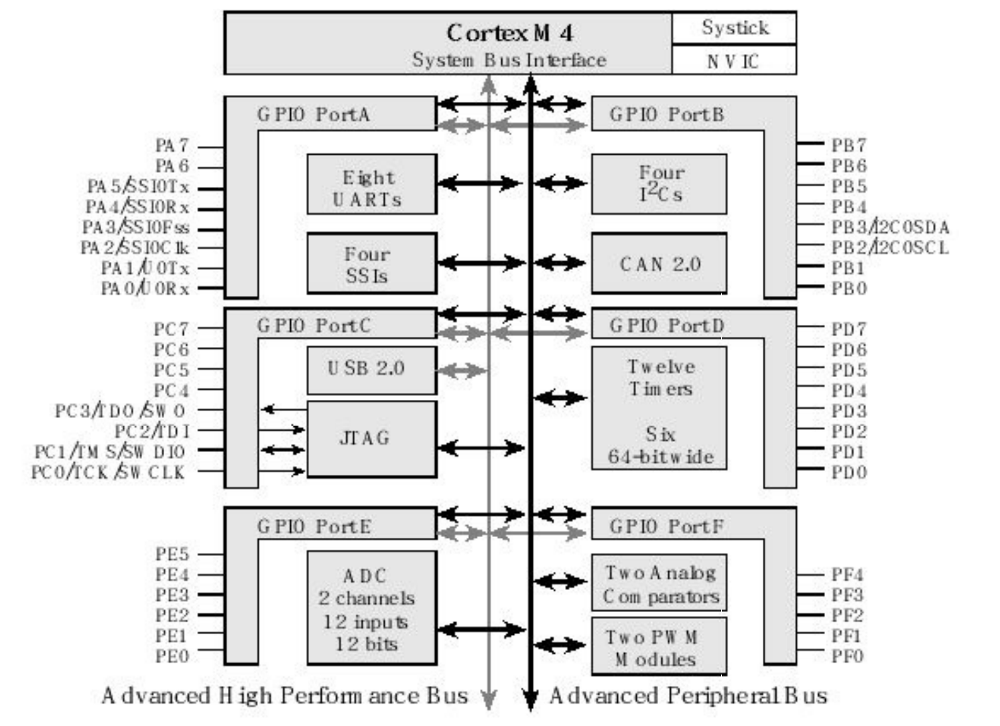
These microcontrollers are used on the EK-LM4F120XL and EK-TM4C123GXL LaunchPads. 
Pins on the LM3S family have two possibilities: digital I/O or an alternative function. 
    However, pins on the TM4C family can be assigned to as many as eight different I/O functions. 
    Pins can be configured for digital I/O, analog input, timer I/O, or serial I/O. 
    For example PA0 can be digital I/O, serial input, or CAN. 
There are two buses used for I/O. 
    The digital I/O ports are connected to both the advanced peripheral bus (like the LM3S family) and the advanced high-performance bus (runs faster). 
    Because of the multiple buses, the microcontroller can perform I/O bus cycles simultaneous with instruction fetches from flash ROM. 
The LM4F120H5QR has eight UART ports, four SSI ports, four I2C ports, two 12-bit ADCs, twelve timers, a CAN port, and a USB interface. 
The TM4C123GH6PM adds up to 16 PWM outputs. 
There are 43 I/O lines. There are twelve ADC inputs; each ADC can convert up to 1 million samples per second. 
Table lists the regular and alternate names of the port pins.

Pin         Ain         0       1       2       3       4       5       6       7       8       9       14
PA0                     Port    U0Rx                                                    CAN1Rx
PA1                     Port    U0Tx                                                    CAN1Tx
PA2                     Port            SSI0Clk
PA3                     Port            SSI0Fss
PA4                     Port            SSI0Rx
PA5                     Port            SSI0Tx
PA6                     Port                    I2C1SCL         M1PWM2
PA7                     Port                    I2C1SDA         M1PWM3
PB0                     Port     U1Rx                                           T2CCP0
PB1                     Port     U1Tx                                           T2CCP1
PB2                     Port                    I2C0SCL                         T3CCP0
PB3                     Port                    I2C0SDA                         T3CCP1
PB4         Ain10       Port            SSI2Clk          M0PWM2                 T1CCP0  CAN0Rx
PB5         Ain11       Port            SSI2Fss          M0PWM3                 T1CCP1  CAN0Tx
PB6                     Port            SSI2Rx           M0PWM0                 T0CCP0
PB7                     Port            SSI2Tx           M0PWM1                 T0CCP1
PC4 C1-                 Port     U4Rx   U1Rx            M0PWM6           IDX1   WT0CCP0U1RTS
PC5 C1+                 Port     U4Tx   U1Tx            M0PWM7           PhA1   WT0CCP1U1CTS
PC6 C0+                 Port     U3Rx                                    PhB1   WT1CCP0USB0epen
PC7 C0-                 Port     U3Tx                                           WT1CCP1USB0pflt
PD0         Ain7        Port    SSI3Clk SSI1Clk I2C3SCL M0PWM6M1PWM0            WT2CCP0
PD1         Ain6        Port    SSI3Fss SSI1Fss I2C3SDA M0PWM7M1PWM1            WT2CCP1
PD2         Ain5        Port    SSI3Rx  SSI1Rx          M0Fault0                WT3CCP0USB0epen
PD3         Ain4        Port    SSI3Tx  SSI1Tx                          IDX0    WT3CCP1USB0pflt
PD4         USB0DM      Port    U6Rx                                            WT4CCP0
PD5         USB0DP      Port    U6Tx                                            WT4CCP1
PD6                     Port    U2Rx                    M0Fault0        PhA0    WT5CCP0
PD7                     Port    U2Tx                                    PhB0    WT5CCP1NMI
PE0         Ain3        Port    U7Rx
PE1         Ain2        Port    U7Tx
PE2         Ain1        Port
PE3         Ain0        Port
PE4         Ain9        Port    U5Rx             I2C2SCL M0PWM4M1PWM2                    CAN0Rx
PE5         Ain8        Port    U5Tx             I2C2SDA M0PWM5M1PWM3                    CAN0Tx
PF0         Port                U1RTS   SSI1Rx  CAN0Rx   M1PWM4PhA0             T0CCP0   NMI    C0o
PF1         Port                U1CTS   SSI1Tx M1PWM5PhB0 T0CCP1 C1o TRD1
PF2         Port                        SSI1Clk         M0Fault0 M1PWM6         T1CCP0                  TRD0
PF3         Port                        SSI1Fss CAN0Tx           M1PWM7         T1CCP1                  TRCLK
PF4         Port                                                 M1Fault0 IDX0  T2CCP0  USB0epen
    PMCx bits in the GPIOPCTL register on the LM4F/TM4C specify alternate functions. 
    PD4 and PD5 are hardwired to the USB device. 
    PA0 and PA1 are hardwired to the serial port. 
    PWM not on LM4F120.

Each pin has one configuration bit in the AMSEL register. 
    We set this bit to connect the port pin to the ADC or analog comparator. 
For digital functions, each pin also has four bits in the PCTL register, which we set to specify the alternative function for that pin (0 means regular I/O port). 
    Table shows the 4-bit PCTL configuration used to connect each pin to its alternate function. 
    For example, column “5” means set 4-bit field in PCTL to 0101.
Pins PC3 – PC0 were left off Table because these four pins are reserved for the JTAG debugger and should not be used for regular I/O. 
Notice, some alternate function modules (e.g., U0Rx) only exist on one pin (PA0). While other functions could be mapped to two or three pins (e.g., CAN0Rx could be mapped to one of the following: PB4, PE4, or PF0.)
    For example, if we wished to use UART7 on pins PE0 and PE1, 
        we would set bits 1,0 in the DEN register (enable digital), 
        clear bits 1,0 in the AMSEL register (disable analog), 
        write a 0001,0001 to bits 7–0 in the PCTL register (enable UART7 functionality), 
        and set bits 1,0 in the AFSEL register (enable alternate function). 
    If we wished to sample an analog signal on PD0, 
        we would set bit 0 in the alternate function select register AFSEL, 
        clear bit 0 in the digital enable register DEN (disable digital),
        set bit 0 in the analog mode select register AMSEL (enable analog), 
        and activate one of the ADCs to sample channel 7. 
    Additional examples will be presented throughout the book.

The Tiva ® LaunchPad evaluation board (Figure) is a low-cost development board available as part number EK-LM4F120XL and EK-TM4C123GXL from www.ti.com and from regular electronic distributors like Digikey, Mouser, Newark, and Avnet. 
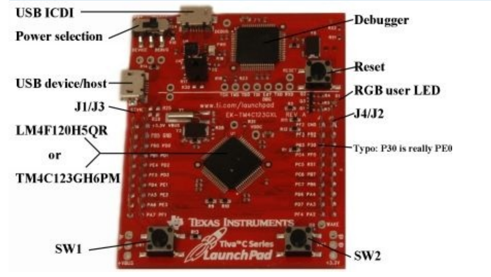
The kit provides an integrated In-Circuit Debug Interface (ICDI), which allows programming and debugging of the onboard LM4F microcontroller. 
One USB cable is used by the debugger (ICDI), and the other USB allows the user to develop USB applications (device or host). 
The user can select board power to come from either the debugger (ICDI) or the USB device (device) by setting the Power selection switch.

Pins PA1 – PA0 create a serial port, which is linked through the debugger cable to the PC. 
    The serial link is a physical UART as seen by the LM4F/TM4C and mapped to a virtual COM port on the PC. 
The USB device interface uses PD4 and PD5. 
The JTAG debugger requires pins PC3 – PC0. 
The LaunchPad connects PB6 to PD0, and PB7 to PD1. 
    If you wish to use both PB6 and PD0 you will need to remove the R9 resistor.
    Similarly, to use both PB7 and PD1 remove the R10 resistor.

The Tiva® LaunchPad evaluation board has two switches and one 3-color LED. See Figure. 
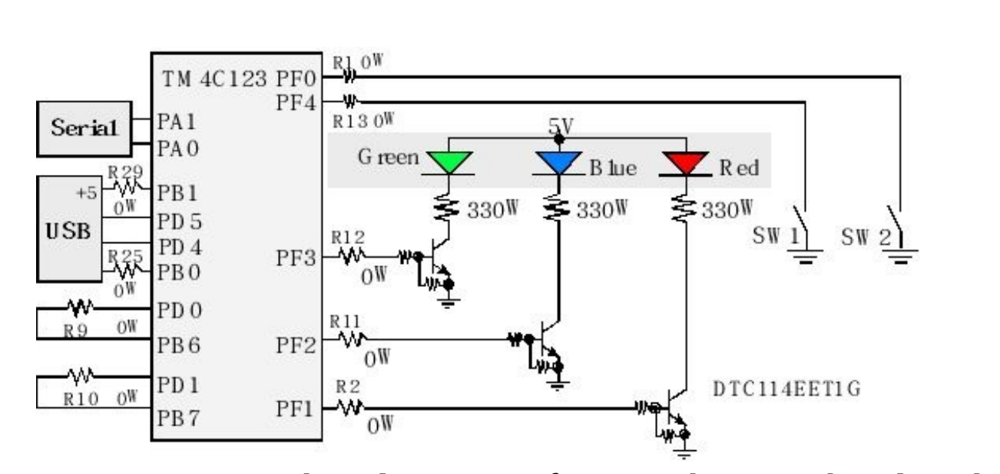
The switches are negative logic and will require activation of the internal pull-up resistors. 
    In particular, you will set bits 0 and 4 in GPIO_PORTF_PUR_R register. 
The LED interfaces on PF3 – PF1 are positive logic. 
    To use the LED, make the PF3 – PF1 pins an output. 
    To activate the red color, output a one to PF1. The blue color is on PF2, and the green color is controlled by PF3. 
    The 0-Ω resistors (R1, R2, R11, R12, R13, R25, and R29) can be removed to disconnect the corresponding pin from the external hardware.

The LaunchPad has four 10-pin connectors, labeled as J1 J2 J3 J4 in Figures , to which you can attach your external signals. 
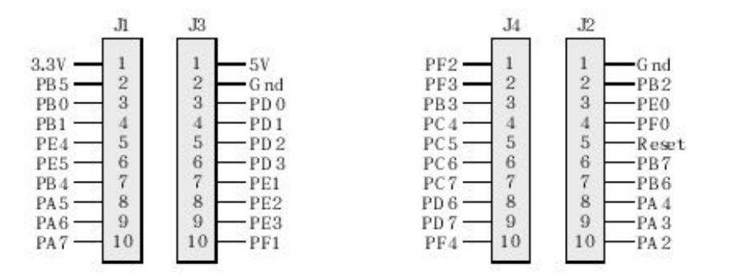
The top side of these connectors has male pins, and the bottom side has female sockets. 
The intent is to stack boards together to make a layered system, see Figure. 
Texas Instruments also supplies Booster Packs, which are pre-made external devices that will plug into this 40-pin connector.
    The Booster Packs for the MSP430 LaunchPad are compatible (one simply plugs these 20-pin connectors into the outer two rows) with this board. 
    The inner 10-pin headers (connectors J3 and J4) are not intended to be compatible with other TI LaunchPads. 
    J3 and J4 apply only to Stellaris/Tiva Booster Packs.
There are two methods to connect external circuits to the LaunchPad. 
    One method uses male to female jumper cable (e.g., item number 826 at www.adafruit.com) or solder a solid wire into a female socket (e.g., Hirose DF11-2428SCA) creating a male to female jumper wire. 
    The second method uses male-male wires and connect to the bottom of the LaunchPad

==============================================================================
                     *Texas Instruments TM4C1294 Connected LaunchPad I/O pins*

Figure shows the 90 I/O pins available on the TM4C1294NCPDT, which is the microcontroller used on the Connected LaunchPad.
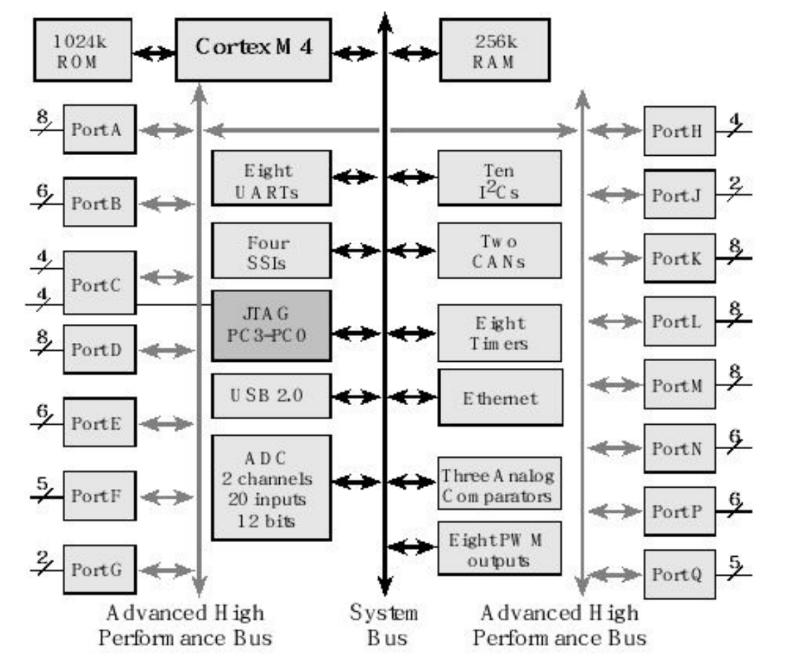
Pins on the TM4C family can be assigned to as many as seven different I/O functions, see Table. 
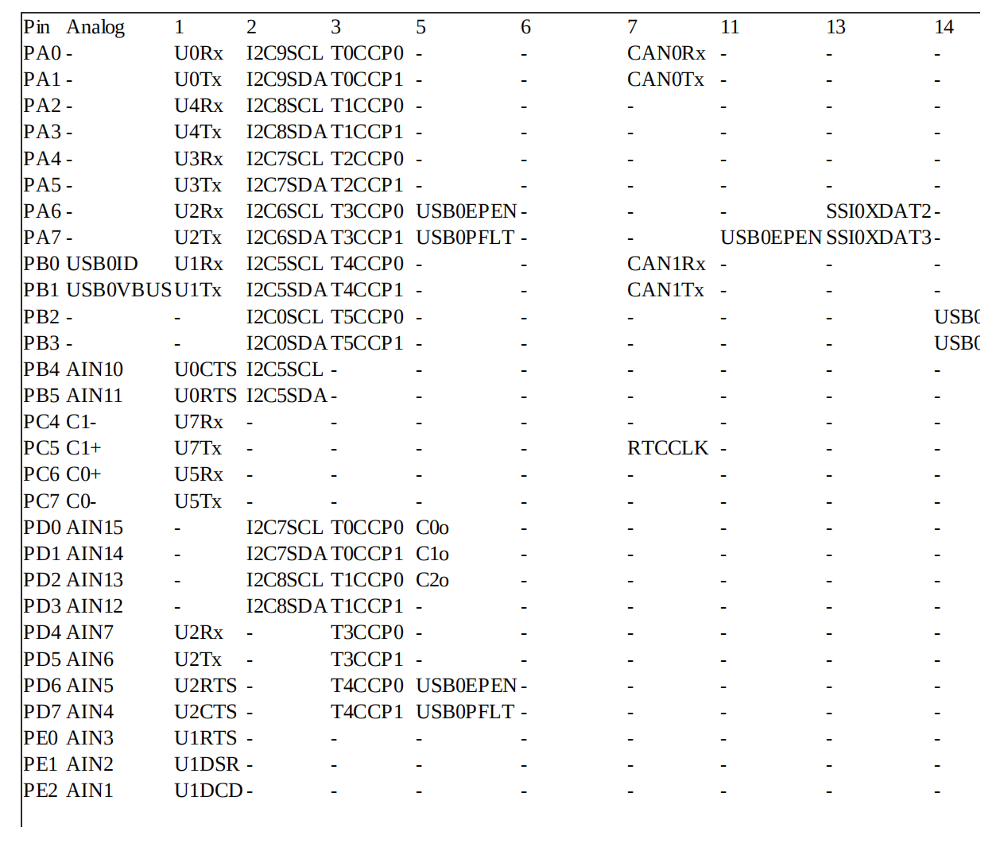
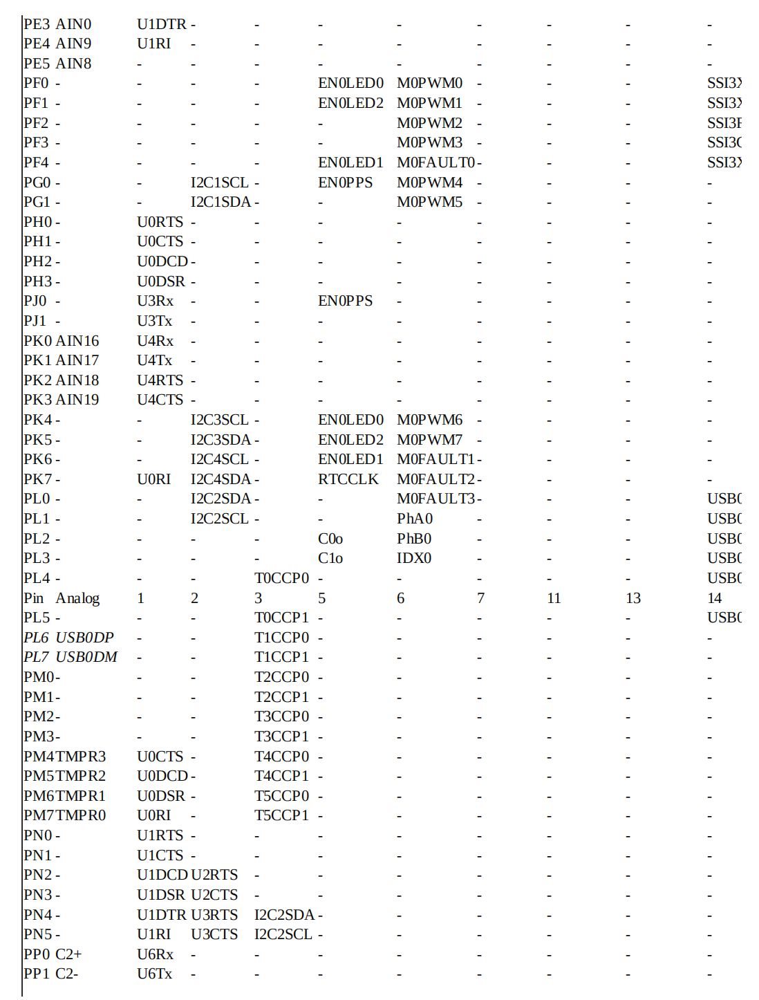
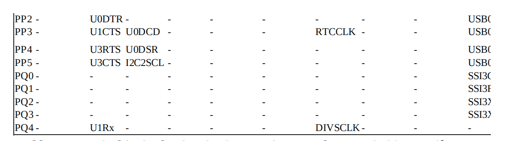
Pins can be configured for digital I/O, analog input, timer I/O, or serial I/O. 
    For example PA0 can be digital I/O, serial input, I2C clock, Timer I/O, or CAN receiver. 
There are two buses used for I/O. 
    Unlike the TM4C123, the digital I/O ports are only connected to the advanced high-performance bus. 
The microcontroller can perform I/O bus cycles simultaneous with instruction fetches from flash ROM. 
The TM4C1294NCPDT has eight UART ports, four SSI ports, ten I2C ports, two 12-bit ADCs, eight timers, two CAN ports, a USB interface, 8 PWM outputs, and an Ethernet port. 
Of the 90 I/O lines, twenty pins can be used for analog inputs to the ADC. The ADC can convert up to 1M samples per second. 
Table lists the regular and alternate functions of the port pins.

Figure shows the pin locations of the two Booster Pack connectors. 
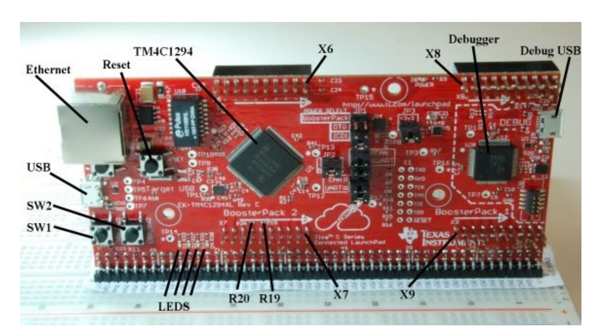
There are three methods to connect external circuits to the Connected LaunchPad. 
    One method uses male to female jumper cable (e.g., item number 826 at www.adafruit.com) or solder a solid wire into a female socket (e.g., Hirose DF11-2428SCA) creating a male-tofemale jumper wire. 
        In this method, you connect the female socket to the top of the LaunchPad and the male pin into a solderless breadboard. 
    The second method uses male-to-male wires interfacing to the bottom of the LaunchPad. 
    The third method uses two 49-pin right-angle headers so the entire LaunchPad can be plugged into a breadboard. 
    You will need one each of Samtec parts TSW-149-09-L-S-RE and TSW- 149-08-L-S-RA. 
    This configuration is shown in Figure, and directions can be found at http://users.ece.utexas.edu/~valvano/arm/TM4C1294soldering.pdf
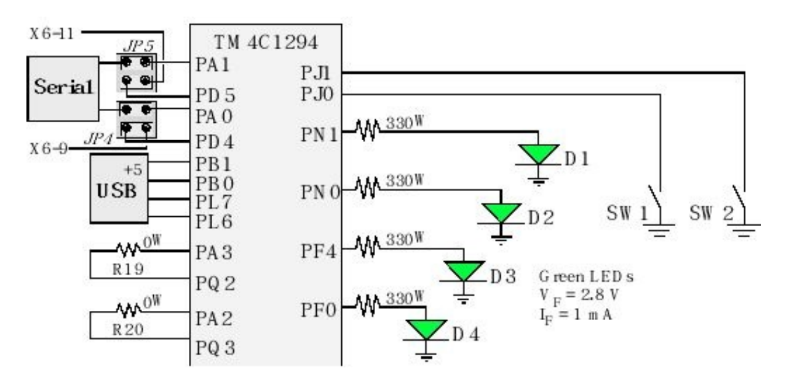
The Connected LaunchPad has two switches and four LEDs. 
    Switch SW1 is connected to pin PJ0, and SW2 is connected to PJ1. 
    These two switches are negative logic and require enabling the internal pull up (PUR). 
    A reset switch will reset the microcontroller and your software will start when you release the switch. 
    Positive logic LEDs D1, D2, D3, and D4 are connected to PN1, PN0, PF4, and PF0 respectively. 
    A power LED indicates that 3.3 volt power is present on the board. 
    R19 is a 0 Ω resistor connecting PA3 and PQ2. Similarly, R20 is a 0 Ω resistor connecting PA2 and PQ3. 
    You need to remove R19 if you plan to use both PA3 and PQ2. 
    You need to remove R20 if you plan to use both PA2 and PQ3.
Jumper JP1 has six pins creating three rows of two. 
    Exactly one jumper should be connected in the JP1 block, which selects the power source. 
    The top position is for BoosterPack power. 
    The middle position draws power from the USB connector, labeled OTG, on the left side of the board near the Ethernet jack. 
    We recommend placing the JP1 jump in the bottom position so power is drawn from the ICDI (Debug) USB connection. 
    Under normal conditions, you should place jumpers in both J2 and J3.
Jumpers J2 and J3 facilitate measuring current to the microcontroller. 
We recommend you place JP4 and JP5 in the “UART” position so PA1 and PA0 are connected to the PC as a virtual COM port. 
Your code runs on the 128-pin TM4C1294 microcontroller.
There is a second TM4C microcontroller on the board, which acts as the JTAG debugger for your TM4C1294. 
You connect the Debug USB to a PC in order to download and debug software on the board. 
The other USB is for user applications.

Each pin has one configuration bit in the AMSEL register. 
    We set this bit to connect the port pin to the ADC or analog comparator. 
For digital functions, each pin also has four bits in the PCTL register, which we set to specify the alternative function for that pin (0 means regular I/O port). 
    Table shows the 4-bit PCTL configuration used to connect each pin to its alternate function. 
    For example, column “3” means set 4-bit field in PCTL to 0011.
    Pins PC3 – PC0 were left off Table because these four pins are reserved for the JTAG debugger and should not be used for regular I/O. 
    Notice, some alternate function modules (e.g., U0Rx) only exist on one pin (PA0). While other functions could be mapped to two or three pins. 
        For example, T0CCP0 could be mapped to one of the following: PA0, PD0, or PL4.
    The PCTL bits in Table can be tricky to understand. 
        For example, if we wished to use UART6 on pins PP0 and PP1, 
                        we would set bits 1,0 in the DEN register (enable digital), 
                        clear bits 1,0 in the AMSEL register (disable analog), 
                        write a 0001,0001 to bits 7–0 in the PCTL register (enable UART6 functionality), and 
                        set bits 1,0 in the AFSEL register (enable alternate function). 
                     If we wished to sample an analog signal on PD0, 
                        we would set bit 0 in the alternate function select register AFSEL, 
                        clear bit 0 in the digital enable register DEN (disable digital), 
                        set bit 0 in the analog mode select register AMSEL (enable analog), and 
                        activate one of the ADCs to sample channel 15.
        Additional examples will be presented throughout the book.

Jumpers JP4 and JP5 select whether the serial port on UART0 (PA1 – PA0) or on UART2 (PD5 – 4) is linked through the debugger cable to the PC. 
The serial link is a physical UART as seen by the TM4C1294 and is mapped to a virtual COM port on the PC. 
The USB device interface uses PL6 and PL7. 
The JTAG debugger requires pins PC3 – PC0.

To use the negative logic switches, make the pins digital inputs, and activate the internal pull-up resistors. 
    In particular, you will activate the Port J clock, clear bits 0 and 1 in GPIO_PORTJ_DIR_R register, set bits 0 and 1 in GPIO_PORTJ_DEN_R register, and set bits 0 and 1in GPIO_PORTJ_PUR_R register. 
The LED interfaces are positive logic. 
    To use the LEDs, make the PN1, PN0, PF4, and PF0 pins an output.
    You will activate the Port N clock, set bits 0 and 1in GPIO_PORTN_DIR_R register, and set bits 0 and 1in GPIO_PORTN_DEN_R register. 
    You will activate the Port F clock, set bits 0 and 4in GPIO_PORTF_DIR_R register, and set bits 0 and 4in GPIO_PORTF_DEN_R register.

Basic Concepts of Input and Output Ports

==============================================================================
                                   *Basic Concepts of Input and Output Ports*

The simplest I/O port on a microcontroller is the parallel port. 
    A parallel I/O port is a simple mechanism that allows the software to interact with external devices. 
    It is called parallel because multiple signals can be accessed all at once. 

An input port, which is read only, allows the software to read external digital signals. 
    That means a read cycle access from the port address returns the values existing on the inputs at that time. 
    In particular, the tristate driver (triangle shaped circuit in Figure) will drive the input signals onto the data bus during a read cycle from the port address. 
    .png)
    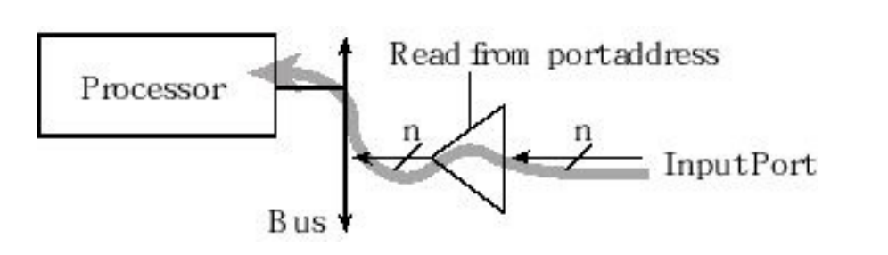
    A write cycle access to an input port usually produces no effect. 
    The digital values existing on the input pins are copied into the microcontroller when the software executes a read from the port address. 

There are no digital input-only ports on the TM4C family of microcontrollers. 
TM4C microcontrollers have 5V-tolerant digital inputs, meaning an input voltage from 2.0 to 5.0 V will be considered high, and a voltage from 0 to 1.3 V will be considered as low. 

While an input device usually just involves the software reading the port, an output port can participate in both the read and write cycles very much like a regular memory.
    Figure describes a readable output port. 
    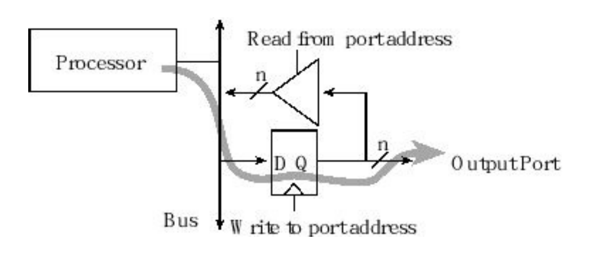
    A write cycle to the port address will affect the values on the output pins. 
    In particular, the microcontroller places information on the data bus and that information is clocked into the D flip-flops(Digital storage devices). 
    Since it is a readable output, a read cycle access from the port address returns the current values existing on the port pins. 

There are no output-only ports on the TM4C family of microcontrollers.

To make the microcontroller more marketable, the ports on TM4C microcontrollers can be software-specified to be either inputs or outputs. 
    Microcontrollers use the concept of a direction register to determine whether a pin is an input (direction register bit is 0) or an output (direction register bit is 1), as shown in Figure. 
    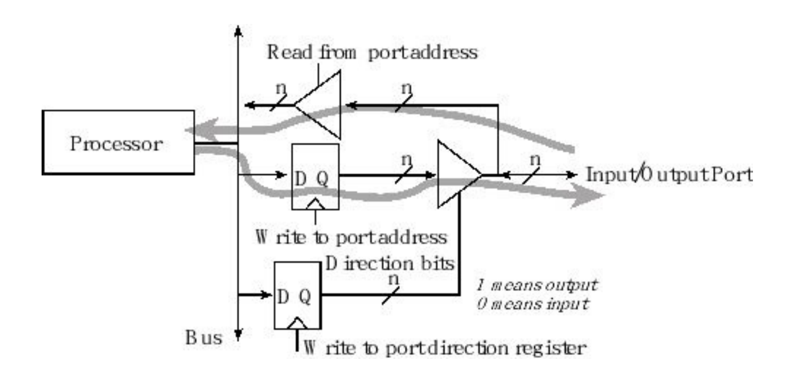
    We define an initialization ritual as a program executed once during start up that initializes hardware and software. 
        If the ritual makes the direction bit zero, the port pin behaves like a simple input, 
        and if it makes the direction bit one, the port pin becomes a readable output. 
        Each digital port pin has its own direction bit. 
            This means some pins on a port may be inputs while others are outputs. 

The digital port pins on most microcontrollers are bidirectional, operating similar to Figure.

Common Error: Many program errors can be traced to confusion between I/O ports and regular memory. 
For example, you should not write to an input port, and sometimes we cannot read from an output port.

==============================================================================
                                  *I/O Programming and the Direction Register*

On most embedded microcontrollers, the I/O ports are memory mapped.
    This means the software can access an input/output port simply by reading from or writing to the appropriate address. 
    the I/O ports often DO NOT act like memory. 
        For example, some bits are read-only, some are write-only, some can only be cleared, others can only be set, and some bits cannot be modified. 

To make our software easier to understand we include symbolic definitions for the I/O ports. 
    We set the direction register(e.g., GPIO_PORTF_DIR_R ) to specify which pins are input and which are output. 
    Individual port pins can be general purpose I/O (GPIO) or have an alternate function. 
    We will set bits in the alternate function register (e.g., GPIO_PORTF_AFSEL_R ) when we wish to activate the alternate functions listed in Tables. 
    To use a pin as a digital input or output, we must set the corresponding bit in the digital enable register(e.g., GPIO_PORTF_DEN_R ). 
    To use a pin as an analog input we must set the corresponding bit in theanalog mode select register (e.g., GPIO_PORTF_AMSEL_R ). 
    Typically, we write to the direction and alternate function registers once during the initialization phase. 
    We use the data register(e.g., GPIO_PORTF_DATA_R ) to perform the actual input/output on the port. 
    Table shows some of the parallel port registers for the TM4C123. 
        Each of the ports has a clock, which can be separately enabled by writing to the SYSCTL_RCGCGPIO_R register.

The only differences among the TM4C family are the number of ports and available pins in each port. 
    For example, the TM4C1294 has fifteen digital I/O ports A (8 bits), B (6 bits), C (8 bits), D (8 bits), E (6 bits), F (5 bits), G (2 bits), H (4 bits), J (2 bits), K (8 bits), L (8 bits), M (8 bits), N(6 bits), P (6 bits), and Q (5 bits). 
    Furthermore, the TM4C1294 has different addresses for ports. 
    Refer to the file tm4c1294ncpdt.h or to the data sheet for more the specific addresses of its I/O ports.

Common Error: You will get a bus fault if you access a port without enabling its clock.

To initialize an I/O port for general use we perform seven steps.
    We will skip steps three four and six in this chapter because the default state after a reset is to disable analog function and disable alternate function.
    First, we activate the clock for the port by setting the corresponding bit in RCGCGPIO register.
        Because it takes time for the clock to stabilize, we next will wait for its status bit in the PRGPIO to be true.
    Second, we unlock the port; 
        unlocking is needed only for pins PD7, and PF0 on the TM4C123. 
        The only pin needing unlocking on the TM4C1294 is PD7. 
    Third, we disable the analog function of the pin, because we will be using the pin for digital I/O.
    Fourth, we clear bits in the PCTL (Tables) to select regular digital function.
    Fifth, we set its direction register. 
        The direction register specifies bit for bit whether the corresponding pins are input or output. 
        A bit in DIR set to 0 means input and 1 means output. 
    Sixth, we clear bits in the alternate function register, and 
    lastly, we enable the digital port. 
        Turning on the clock must be first but the other steps can occur in any order.
    In this first example 
        we will make PF4 and PF0 input, 
        we will make PF3 PF2 and PF1 output, as shown in Programs. 
        To use Port F we first must activate its clock (bit 5)in the SYSCTL_RCGCGPIO_R register. 
        The second step is to unlock the port (TM4C123 only), by writing a special value to the LOCK register, followed by setting bits in the CR register. 
        The fifth step is to specify whether the pin is an input or an output by clearing or setting bits in the DIR register. 
        The last step is to enable the corresponding I/O pins by writing ones to the DEN register. 
        To run this example on the LaunchPad, we also set bits in the PUR register for the two switch inputs (Figure 4.6) to have an internal pull-up resistor.
