 data sheets : https://users.ece.utexas.edu/~valvano/arm/

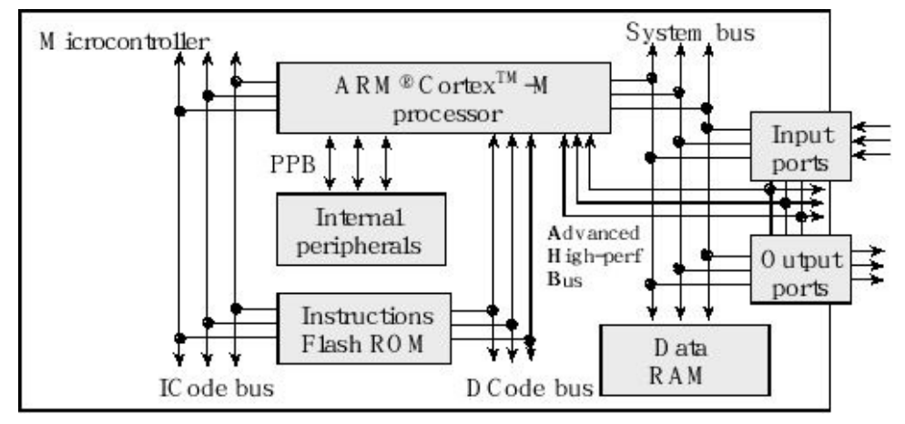

Instructions are fetched from flash ROM using the ICode bus.
Data are exchanged with memory and I/O via the system bus interface.
On the Cortex-M4 there is a second I/O bus for high-speed devices like USB. 
There are many sophisticated debugging features utilizing the DCode bus. 
The nested vectored interrupt controller (NVIC) manages interrupts, which are hardware-triggered software functions.
Some internal peripherals, like the NVIC communicate directly with the processor via the private peripheral bus (PPB). 
    The tight integration of the processor and interrupt controller provides fast execution of interrupt service routines (ISRs), dramatically reducing the interrupt latency.

memory and I/O ports are byte addressable!!!

Registers

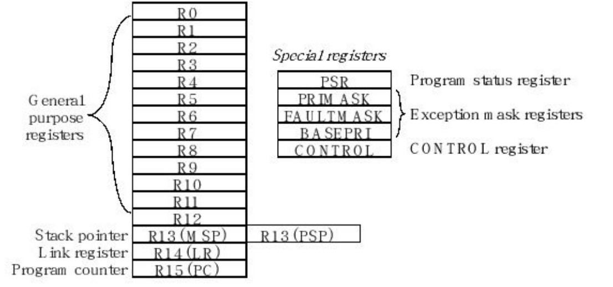

R0 to R12 are general purpose registers and contain either data or addresses.
Register R13 (also called the stack pointer, SP) points to the top element of the stack. 
Register R14 (also called the link register, LR) is used to store the return location for functions. 
The LR is also used in a special way during exceptions, such as interrupts.
Register R15 (also called the program counter, PC) points to the next instruction to be fetched from memory.
    The processor fetches an instruction using the PC and then increments the PC.

>The ARM Architecture Procedure Call Standard, AAPCS, part of the ARM Application Binary Interface (ABI), uses registers R0, R1, R2, and R3 to pass input parameters into a C function.
>Functions must preserve the values of registers R4–R11.
>Also according to AAPCS we place the return parameter in Register R0. 
>AAPCS requires we push and pop an even number of registers to maintain an 8-byte alignment on the stack.

There are three status registers
    Application Program Status Register (APSR)
    the Interrupt Program Status Register (IPSR) 
    and the Execution Program Status Register (EPSR)
These registers can be accessed individually or in combination as the Program Status Register (PSR).

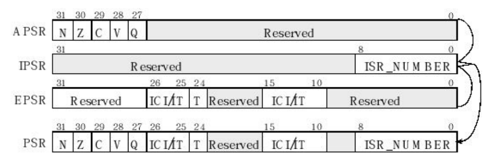

The N, Z, V, C, and Q bits give information about the result of a previous ALU operation. 
    the N bit is set after an arithmetical or logical operation signifying whether or not the result is negative. 
    the Z bit is set if the result is zero. 
    The C bit means carry and is set on an unsigned overflow, 
    the V bit signifies signed overflow. 
    The Q bit indicates that “saturation” has occurred
The T bit will always be 1, indicating the ARM Cortex-M processor is executing Thumb instructions. 
The ISR_NUMBER indicates which interrupt if any the processor is handling.

    Bit 0 of the special register PRIMASK is the interrupt mask bit.
        If this bit is 1, most interrupts and exceptions are not allowed. If the bit is 0, then interrupts are allowed. 
    Bit 0 of the special register FAULTMASK is the fault mask bit.
        If this bit is 1, all interrupts and faults are not allowed. If the bit is 0, then interrupts and faults are allowed. The nonmaskable interrupt (NMI) is not affected by these mask bits.
    The BASEPRI register defines the priority of the executing software. 
        It prevents interrupts with lower or equal priority but allows higher priority interrupts. 
        For example if BASEPRI equals 3, then requests with level 0, 1, and 2 can interrupt, while requests at levels 3 and higher will be postponed.

Reset
    A reset occurs immediately after power is applied and when the reset signal is asserted – this can usually be triggered by pushing the reset button available on most boards.
    The 32-bit value at flash ROM location 0 is loaded into the SP. All stack accesses are word aligned.
    A reset also loads the 32-bit value at location 4 into the PC. This value is called the reset vector.
    All instructions are halfword aligned.
    However, the assembler (or linker) will set the least significant bit in the reset vector, so the processor will properly initialize the Thumb bit (T) in the PSR.
    On reset, the processor initializes the LR to 0xFFFFFFFF.

Memory
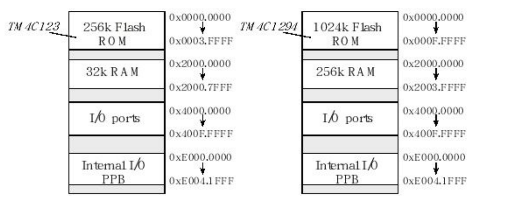

all ARM Cortex-M microcontrollers have similar memory maps. 
In general, Flash ROM begins at address 0x0000.0000, 
            RAM begins at 0x2000.0000, 
            the peripheral I/O space is from 0x4000.0000 to 0x5FFFF.FFFF, 
            and I/O modules on the private peripheral bus (PPB) exist from 0xE000.0000 to 0xE00F.FFFF. 

In particular, the only differences in the memory map for the various 180 members of the LM3S/TM4C family are the ending addresses of the flash and RAM. 
The M4 has an advanced high-performance bus (AHB). 

Having multiple buses means the processor can perform multiple tasks in parallel. The following is some of the tasks that can occur in parallel
    ICode bus Fetch opcodes from ROM
    DCode bus Read constant data from ROM
    System bus Read/write data from RAM or I/O, fetch opcode from RAM
    PPB Read/write data from internal peripherals like the NVIC
    AHB Read/write data from high-speed I/O and parallel ports (M4 only)

Freescale microcomputers implement the big endian approach that stores the most significant byte at the lower address. 
Intel microcomputers implement the little endian approach that stores the least significant byte at the lower address. 
Cortex M microcontrollers use the little endian format. 
Many ARM processors are biendian, because they can be configured to efficiently handle both big and little endian data.
    Common Error: An error will occur when data is stored in Big Endian by one computer and read in Little Endian format on another.

Operating Modes
The processor knows whether it is running in the foreground (i.e., the main program) or in the background (i.e., an interrupt service routine). 
    ARM processors define the foreground as thread mode, and the background as handler mode.
The processor begins in thread mode, signified by ISR_NUMBER=0. 
Whenever it is servicing an interrupt it switches to handler mode, signified by setting ISR_NUMBER to specify which interrupt is being processed. 
    All interrupt service routines run using the MSP. For simplicity all software in this book will use the main stack pointer (MSP).

The Software Development Process
    In a real system, we choose the real microcontroller via its JTAG debugger as the target.
        In this way the object code is downloaded into the EEPROM of the microcontroller. 
        Most microcontrollers contain built-in features that assist in programming their EEPROM. 
        In particular, we will use the JTAG debugger connected via a USB cable to download and debug programs. 
        The JTAG is both a loader and a debugger.
    In contrast, the loader on a general purpose computer typically reads the object code from a file on a hard drive or CD and stores the code in RAM.
         When the program is run, instructions are fetched from RAM. 
         Since RAM is volatile, the programs on a general purpose computer must be loaded each time the system is powered up.
>It is best to have a programming reference manual handy when writing assembly language. 
>These three reference manuals for the Cortex M3/M4 processor are available as pdf files and are posted on the book web site.
>CortexM_InstructionSet.pdf
>CortexM4_TRM_r0p1.pdf
>QuickReferenceCard.pdf
>A description of each instruction can also be found by searching the Contents page of the help engine included with the ARM Keil™ uVision® or TI CCStudio applications.

As we will learn in Chapter 9, interrupt are triggered by hardware events, causing the software interrupt service routine (shown as Clock in Figure 3.9) to be executed. 
    A bus fault occurs if the software accesses an unimplemented memory location or accesses an I/O that is not properly configured. 
    Bus faults are usually caused by software bugs. The computer uses the reset vector to decide where to start (reset or power on).

These exceptions, include
     The computer uses the reset vector to decide where to start (reset or power on).
     A hardware or software mistake will cause a bus fault and stop execution.
     ...

ARM Cortex-M Assembly Language
which executes Thumb ® instructions extended with Thumb-2 technology.
For further details, please refer to the ARM ® Cortex™-M Technical Reference Manual.

Syntax
four fields separated by spaces or tabs : 
    Label    Opcode    Operands    Comment 
Label:
    is optional and starts in the first column and is used to identify the position in memory of the current instruction.
     a unique name for each label.
Opcode:
    specifies the processor command to execute.
Operands:
    specifies where to find the data to execute the instruction.
Comment:
    is also optional and is ignored by the assembler, but it allows you to describe the software making it easier to understand.

describing assembly instructions we will use the following list of symbols
|----Ra Rd Rm Rn Rt and Rt2 represent registers
|----{Rd,} represents an optional destination register
|----#imm12 represents a 12-bit constant, 0 to 4095
|----#imm16 represents a 16-bit constant, 0 to 65535
|----operand2 represents the flexible second operand as described in Section 3.4.2
|----{cond} represents an optional logical condition as listed :
|           the conditions {cond} that we will use for conditional branching.
|           {cond} used on other instructions must be part of an if-then (IT) block,
|
|           Suffix      Flags               Meaning
|           EQ          Z = 1               Equal
|           NE          Z = 0               Not equal
|           CS or HS    C = 1               Higher or same, unsigned ≥
|           CC or LO    C = 0               Lower, unsigned <
|           MI          N = 1               Negative
|           PL          N = 0               Positive or zero
|           VS          V = 1               Overflow
|           VC          V = 0               No overflow
|           HI          C = 1               and Z = 0 Higher, unsigned >
|           LS          C = 0               or Z = 1 Lower or same, unsigned ≤
|           GE          N = V               Greater than or equal, signed ≥
|           LT          N ≠ V               Less than, signed <
|           GT          Z = 0               and N = V Greater than, signed >
|           LE          Z = 1               or N ≠ V Less than or equal, signed ≤
|           AL          Can have any value  Always. This is the default when no suffix specified
|
|----{type} encloses an optional data type as listed in Table 3.3
|----{S} is an optional specification that this instruction sets the condition code bits
|----Rm {, shift} specifies an optional shift on Rm as described in Section 3.4.2
|----Rn {, #offset} specifies an optional offset to Rn as described in Section 3.4.2

The assembler translates assembly source code into object code, which are the machine instructions executed by the processor. 
All object code is halfword-aligned.
When we build a project all files are assembled or compiled then linked together.
     The address values shown in the listing are relative to the particular file being assembled.
     When the entire project is built, the files are linked together, and the linker decides exactly where in memory everything will be. 
     After building the project, it can be downloaded, which programs the object code into flash ROM.
     The listing you see in the debugger will specify the absolute address showing you exactly where in memory your variables and instructions exist.

Addressing Modes and Operands
    The addressing mode is the format the instruction uses to specify the memory location to read or write data.
    The addressing mode is associated more specifically with the operands, and a single instruction could exercise multiple addressing modes for each of the operands.
    All instructions begin by fetching the machine instruction (op code and operand) pointed to by the PC.
    A register that contains the address or the location of the data is called a pointer or index register.
        Indexed addressing mode uses a register pointer to access memory.
            The addressing mode that uses the PC as the pointer is called PC-relative addressing mode.
                It is used for branching, for calling functions, and accessing constant data stored in ROM.
                The LDR instruction will read a 32-bit word from memory and place the data in a register.
    In general, data flows towards the op code (right to left).
        In other words, the register closest to the op code gets the result of the operation.
        eg:
            MOV R2,#100     ; R2=100, immediate addressing
            LDR R2,[R1]     ; R2= value pointed to by R1
            ADD R2,R0       ; R2= R2+R0
            ADD R2,R0,R1    ; R2= R0+R1
    Register list.
        The stack push and stack pop instructions can operate on one register or on a list of registers. 
        SP is the same as R13, LR is the same as R14, and PC is the same as R15.
        eg:
            PUSH {LR}       ; save LR on stack
            POP {LR}        ; remove from stack and place in LR
            PUSH {R1-R3,LR} ; save R1,R2,R3 and link register
            POP {R1-R3,PC}  ; restore R1,R2,R3 and PC
    Immediate addressing. 
        With immediate addressing mode, the data itself is contained in the instruction.
        Once the instruction is fetched no additional memory access cycles are required to get the data.
        eg:
            MOV R0,#100     ; R0=100, immediate addressing
        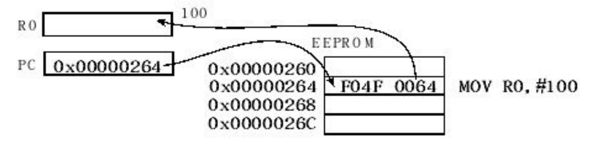
    Indexed addressing
        With indexed addressing mode, the data is in memory and a register will contain a pointer to the data. 
        Once the instruction is fetched, one or more additional memory access cycles are required to read or write the data. 
        eg:
            In these examples, R1 points to RAM.
            LDR R0,[R1]            ; R0= value pointed to by R1
            LDR R0,[R1,#4]         ; R0= word pointed to by R1+4
            LDR R0,[R1,#4]         ; first R1=R1+4, then R0= word pointed to by R1
            LDR R0,[R1],#4         ; R0= word pointed to by R1, then R1=R1+4
            LDR R0,[R1,R2]         ; R0= word pointed to by R1+R2
            LDR R0,[R1,R2, LSL #2] ; R0= word pointed to by R1+4*R2
            R1 could be pointing to any valid object in the memory map (i.e., RAM, ROM, or I/O), and R1 is not modified by this instruction.
        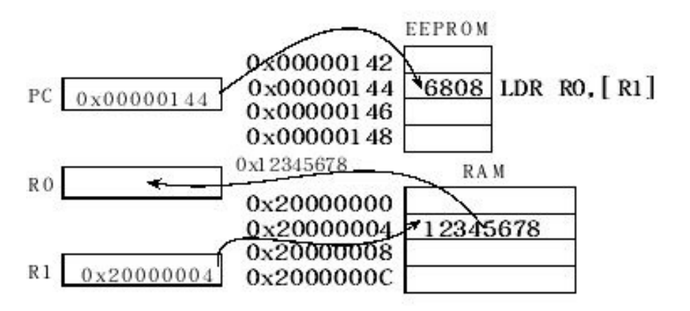
        R1 points to RAM, the instruction LDR R0,[R1,#4] will read the 32- bit value pointed to by R1+4 and place it in R0. 
        Even though the memory address is calculated as R1+4, the Register R1 itself is not modified by this instruction.
        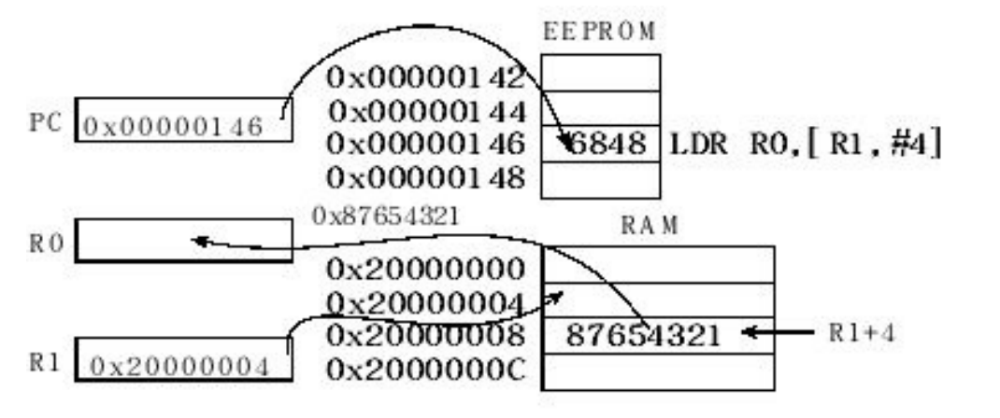
    PC-relative addressing
        PC-relative addressing is indexed addressing mode using the PC as the pointer
        The PC always points to the instruction that will be fetched next, so changing the PC will cause the program to branch.
        In assembly language, we simply specify the label to which we wish to jump, and the assembler encodes the instruction with the appropriate PC-relative offset.
        eg:
            B Location      ; jump to Location, using PC-relative addressing
        The same addressing mode is used for a function call. Upon executing the BL instruction, the return address is saved in the link register (LR).
        In assembly language, we simply specify the label defining the start of the function, and the assembler creates the appropriate PC-relative offset.
        eg:
            BL Subroutine   ; call Subroutine, using PC-relative addressing
    Typically, it takes two instructions to access data in RAM or I/O. 
        The first instruction uses PC-relative addressing to create a pointer to the object, and 
        the second instruction accesses the memory using the pointer.
        We can use the =Something operand for any symbol defined by our program.
        eg:
            In this case Count is the label defining a 32-bit variable in RAM.
            LDR R1,=Count   ; R1 points to variable Count, using PC-relative
            The assembler places a constant 0x2000.0000 in code spaceand translates the =Count into the correct PC-relative access to the constant (e.g., LDR R1, [PC,#28] ).
            LDR R0,[R1]     ; R0= value pointed to by R1
        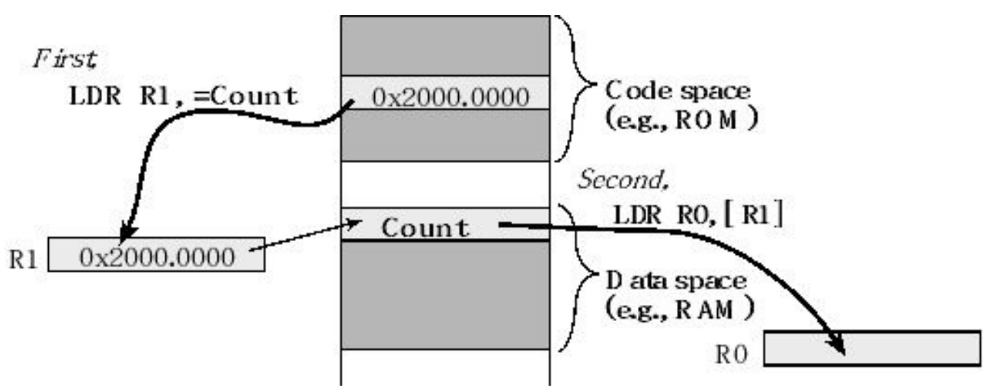
>Code space is where we place programs and data space is where we place variables.
    Flexible second operand <op2>. 
        Many instructions have a flexible second operand, shown as <op2> in the descriptions of theinstruction. 
        <op2> can be a constant or a register with optional shift. 
        The flexible second operand can be a constant in the form #constant
        eg:
            ADD Rd, Rn, #constant   ;Rd = Rn+constant
        We can also specify a flexible second operandin the form Rm {,shift} . 
        If Rd is missing, Rn is also the destination.
        eg:
            ADD Rd, Rn, Rm {,shift} ;Rd = Rn+Rm
            ADD Rn, Rm {,shift}     ;Rn = Rn+Rm
        where Rm is the register holding the data for the second operand, and shift is an optional shift to be applied to Rm . 
        The optional shift can be one of these five formats:
            ASR #n      Arithmetic (signed) shift right n bits, 1 ≤ n ≤ 32.
            LSL #n      Logical (unsigned) shift left n bits, 1 ≤ n ≤ 31.
            LSR #n      Logical (unsigned) shift right n bits, 1 ≤ n ≤ 32.
            ROR #n      Rotate right n bits, 1 ≤ n ≤ 31.
            RRX         Rotate right one bit, with extend.
        However, the contents in the register Rm remain unchanged. For example,
            ADD R0,R1,LSL #4        ; R0 = R0 + R1*16 (R1 unchanged)
            ADD R0,R1,R2,ASR #4     ; signed R0 = R1 + R2/16 (R2 unchanged)
>An aligned access is an operation where a word-aligned address is used for a word, dual word, or multiple word access, or where a halfword-aligned address is used for a halfword access.
>Byte accesses are always aligned. 
>The address of an aligned word access will have its bottom two bits equal to zero.
>An unaligned word access means we are accessing a 32-bit object (4 bytes) but the address is not evenly divisible by 4.
>The address of an aligned halfword access will have its bottom bit equal to zero. 
>An unaligned halfword access means we are accessing a 16-bit object (2 bytes) but the address is not evenly divisible by 2.
>The Cortex-M processor supports unaligned access only for the following instructions:
>   LDR Load 32-bit word
>   LDRH Load 16-bit unsigned halfword
>   LDRSH Load 16-bit signed halfword (sign extend bit 15 to bits 31- 16)
>   STR Store 32-bit word
>   STRH Store 16-bit halfword
>Note that there is no such thing as a signed or unsigned store. 
>For example, there is no STRSH ; there is only STRH . This is because 8, 16, or all 32 bits of the register are stored to an 8-, 16-, or 32-bit location, respectively.
>No promotion occurs. This means that the value stored to memory can be different from the value located in the register if there is overflow.
>Transfers of one byte are allowed for the following instructions:
>   LDRB Load 8-bit unsigned byte
>   LDRSB Load 8-bit signed byte (sign extend bit 7 to bits 31-8)
>   STRB Store 8-bit byte
>When loading a 32-bit register with an 8- or 16-bit value, it is important to use the proper load, depending on whether the number being loaded is signed or unsigned. 
>This determines what is loaded into the most significant bits of the register to ensure that the number keeps the same value when it is promoted to 32 bits. 
>When loading an 8-bit unsigned number, the top 24 bits of the register will become zero. 
>When loading an 8- bit signed number, the top 24 bits of the register will match bit 7 of the memory data (signed extend).
>All other read and write memory operations generate a usage fault exception if they perform an unaligned access, and therefore their accesses must be address aligned.
>Also, unaligned accesses are usually slower than aligned accesses, and some areas of memory do not support unaligned accesses. 
>But unaligned accesses may allow programs to use memory more efficiently at the cost of performance. The tradeoff between speed and size is a common motif.

Memory Access Instructions
Usually code space is in ROM, but it is possible to assign code space to RAM. 
Data space is where we place variables.

There are four types of memory objects, and typically we use a specific register to access them.
Memory object type              Register            Example
Constants in code space         PC                  =Constant [PC,#28]
Local variables on the stack    SP                  [SP,#0x04]
Global variables in RAM         R0 – R12            [R0]
I/O ports                       R0 – R12            [R0]

The ADR instruction uses PC-relative addressing and is a handy way to generate a pointer to a constant in code space or an address within the program.
The general form for ADR is
    ADR{cond} Rd, label
    label is a label within the code space within the range of -4095 to +4095 from the address in the PC
    the assembler will generate an ADD or SUB instruction to calculate the desired address using an offset to the PC.
    DCD is an assembler directive that defines a 32-bit constant. We use it to create constants in code space (ROM).
    eg:
        ADR R5,Pi   ;R5 points to Pi
        LDR R6,[R5] ;R6 = 314159
        ...
        BX LR
        Pi DCD 314159

use the LDR instruction to load data from memory into a register
There is a special form of LDR which instructs the assembler to load a constant or address into a register.
    LDR{cond} Rd, =number
    LDR{cond} Rd, =label

A similar approach can be used to access I/O ports. 
    On the TM4C family, Port A exists at address 0x4000.43FC. 
    After executing the first LDR instruction, R5 equals 0x4000.43FC, which is a pointer to Port A, and 
    after executing the second LDR instruction, R6 contains the value at Port A at the time it was read.
    eg:
        LDR R5,=0x400043FC ;R5=0x400043FC, R5 points to PortA
        LDR R6,[R5]        ;Input from PortA into R6
        ; ...
        BX LR
    The assembler translated the above assembly into this equivalent(the #16 represents the number of bytes between the LDR R6,[R5] instruction and the DCD definition).
        LDR R5,[PC,#16]     ;PC+16 is the address of the DCD
        LDR R6,[R5]
        ; ...
        BX LR
        DCD 0x400043FC

We use the LDR instruction to load data from RAM to a register and the STR instruction to store data from a register to RAM. 

it creates a copy of the data and places the copy at the new location. 
In other words, since the original data still exists in the previous location, there are now two copies of the information.
The exception to this memory-access-creates-two-copies-rule is a stack pop. 
    When we pop data from the stack, it no longer exists on the stack leaving us just one copy. 
    For example, the instruction LDR R0,[R1] loads the contents of the variable Count into R0. 
        At this point, there are two copies of the data, the original in RAM and the copy in R0. If we next add 1 to R0, the two copies have different values.
When we learn about interrupts in Chapter 9, we will take special care to handle shared information stored in global RAM, making sure we access the proper copy.

When accessing memory data, the type of data can be 8, 16, 32, or 64 bits wide. 
For 8- bit and 16-bit accesses the type can also be signed or unsigned. 
To specify the data type we add an optional modifier, as listed in Table. 
    When we load an 8-bit or 16-bit unsigned value into a register, the most significant bits are filled with 0, called zero pad.
    When we load an 8-bit or 16-bit signed value into a register, the sign bit of the value is filled into the most significant bits, called sign extension.
        This way, if we load an 8-bit -10 (0xF6) into a 32-bit register, we get the 32-bit -10 (0xFFFF.FFF6). 
        When we store an 8-bit or 16-bit value, only the least significant bits are used.

{type}          Data                        type Meaning
                32-bit word                 0 to 4,294,967,295 or -2,147,483,648 to +2,147,483,647
B               Unsigned 8-bit byte         0 to 255, Zero pad to 32 bits on load
SB              Signed 8-bit byte           -128 to +127, Sign extend to 32 bits on load
H               Unsigned 16-bit halfword    0 to 65535, Zero pad to 32 bits on load
SH              Signed 16-bit halfword      -32768 to +32767, Sign extend to 32 bits on load
D               64-bit data                 Uses two registers

Optional modifier to specify data type when accessing memory.

Most of the addressing modes listed in the previous section can be used with load and store. 
The following lists the general form for some of the load and store instructions
    LDR{type}{cond} Rd, [Rn]            ; load memory at [Rn] to Rd
    STR{type}{cond} Rt, [Rn]            ; store Rt to memory at [Rn]
    LDR{type}{cond} Rd, [Rn, #n]        ; load memory at [Rn+n] to Rd
    STR{type}{cond} Rt, [Rn, #n]        ; store Rt to memory [Rn+n]
    LDR{type}{cond} Rd, [Rn,Rm,LSL #n]  ; load memory at [Rn+Rm<<n] to Rd
    STR{type}{cond} Rt, [Rn,Rm,LSL #n]  ; store Rt to memory [Rn+Rm<<n]

The move instructions get their data from the machine instruction or from within the processor and do not require additional memory access instructions.
    MOV{S}{cond} Rd, <op2>              ; set Rd equal to the value specified by op2
    MOV{cond} Rd, #im16                 ; set Rd equal to im16, im16 is 0 to 65535
    MVN{S}{cond} Rd, <op2>              ; set Rd equal to the -value specified by op2

Logical Operations
Software uses logical and shift operations to combine information, to extract information and to test information. 
These operations are performed in a bit-wise fashion on two 32-bit input parameters yielding one 32-bit output result. 
The result is stored into the destination register. 
    For example, the calculation r=m&n means each bit is calculated separately, r31=m31&n31, r30=m30&n30, …, r0=m0&n0.

In C, when we write r=m&n; r=m|n; r=m^n; the logical operation occurs in a bitwise fashion. 
However, in C we define the Boolean functions as r=m&&n; r=m||n; For Booleans,the operation occurs in a word-wise fashion. 
    For example, r=m&&n; means r will become zero if either m is zero or n is zero. Conversely, r will become 1 if both m is nonzero and n is nonzero.

All instructions place the result into the destination register Rd . If Rd is omitted, the result is placed into Rn , which is the register holding the first operand. 
If the optional S suffix is specified, the N and Z condition code bits are updated on the result of the operation.
    AND{S}{cond} {Rd,} Rn, <op2>        ;Rd=Rn&op2
    ORR{S}{cond} {Rd,} Rn, <op2>        ;Rd=Rn|op2
    EOR{S}{cond} {Rd,} Rn, <op2>        ;Rd=Rn^op2
    BIC{S}{cond} {Rd,} Rn, <op2>        ;Rd=Rn&(~op2)
    ORN{S}{cond} {Rd,} Rn, <op2>        ;Rd=Rn|(~op2)

Observation: We use the logical OR to make bits become one, and we use the logical AND to make bits become zero.

Shift Operations
Like programming in C, the assembly shift instructions take two input parameters and yield one output result. 
In C, the left shift operator is << and the right shift operator is >>.

logical shift right (LSR) 
    is similar to an unsigned divide by 2^n , where n is the number of bits shifted. 
    A zero is shifted into the most significant position, and the carry flag will hold the last bit shifted out. 
    The right shift operations do not round. 
        For example, a right shift by 3 bits is similar to divide by 8. However, 15 right-shifted three times (15>>3) is 1, while 15/8 is much closer to 2. 
    In general, the LSR discards bits shifted out, and the UDIV truncates towards 0. 
    Thus, when using UDIV to divide unsigned numbers by a power of 2, UDIV and LSR yield identical results.

Aarithmetic shift right (ASR)
    is similar to a signed divide by 2^n . 
    Notice that the sign bit is preserved, and the carry flag will hold the last bit shifted out. 
    This right shift operation also does not round. 
    Again, a right shift by 3 bits is similar to divide by 8.
        However, -9 right-shifted three times (-9>>3) is -2, while implementing -9 divided by 8 using the SDIV instruction yields -1. 
    In general, the ASR discards bits shifted out, and the SDIV truncates towards 0.

logical shift left (LSL)
     operation works for both unsigned and signed multiply by 2 ^ n. 
     A zero is shifted into the least significant position, and the carry bit will contain the last bit that was shifted out.

All shift instructions place the result into the destination register Rd . 
Rm is the register holding the value to be shifted. 
The number of bits to shift is either in register Rs , or specified as a constant n . 
If the optional S suffix is specified, the N and Z condition code bits are updated on the result of the operation. 
The C bit is the carry out after the shift as shown. These shift instructions will leave the V bit unchanged.

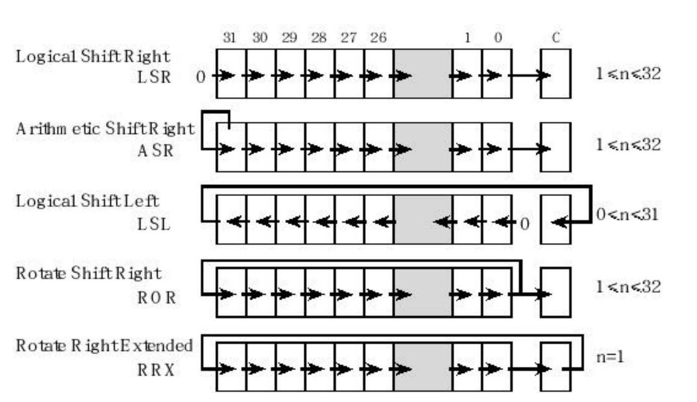

LSR{S}{cond} Rd, Rm, Rs     ; logical shift right Rd=Rm>>Rs (unsigned)
LSR{S}{cond} Rd, Rm, #n     ; logical shift right Rd=Rm>>n (unsigned)
ASR{S}{cond} Rd, Rm, Rs     ; arithmetic shift right Rd=Rm>>Rs (signed)
ASR{S}{cond} Rd, Rm, #n     ; arithmetic shift right Rd=Rm>>n (signed)
LSL{S}{cond} Rd, Rm, Rs     ; shift left Rd=Rm<<Rs (signed, unsigned)
LSL{S}{cond} Rd, Rm, #n     ; shift left Rd=Rm<<n (signed, unsigned)
ROR{S}{cond} Rd, Rm, Rs     ; rotate right
ROR{S}{cond} Rd, Rm, #n     ; rotate right
RXX{S}{cond} Rd, Rm         ; rotate right 1 bit with extension

Arithmetic Operations
When software executes arithmetic instructions, the operations are performed by digital hardware inside the processor.
It is important to remember that arithmetic operations (addition, subtraction, multiplication, and division) have constraints when performed with finite precision on a processor.
An overflow error occurs when the result of an arithmetic operation cannot fit into the finite precision of the register into which the result is to be stored.
Although we use the same instructions, we must use separate overflow detection for signed and unsigned operations.
We begin the design of an adder circuit with a simple subcircuit called a binary full adder
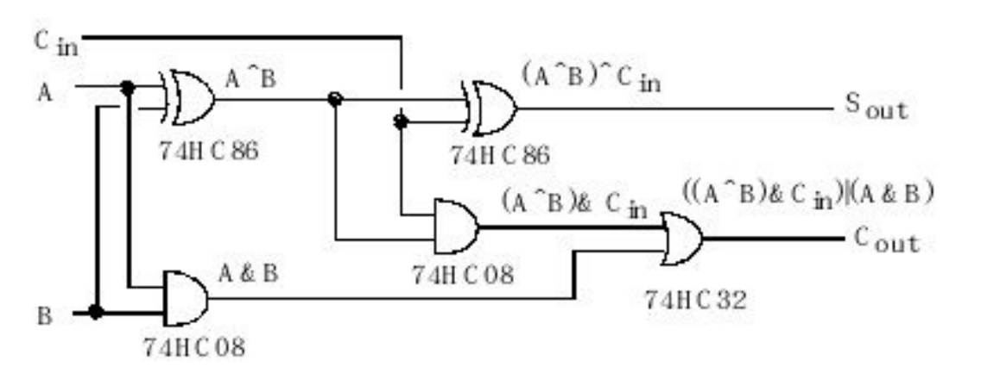
    There are two binary data inputs A, B, and a carry input, Cin. 
    There is one data output, Sout , and one carry output, Cout.
For an 8-bit unsigned number,
    an 8-bit adder formed by cascading eight binary full adders.
    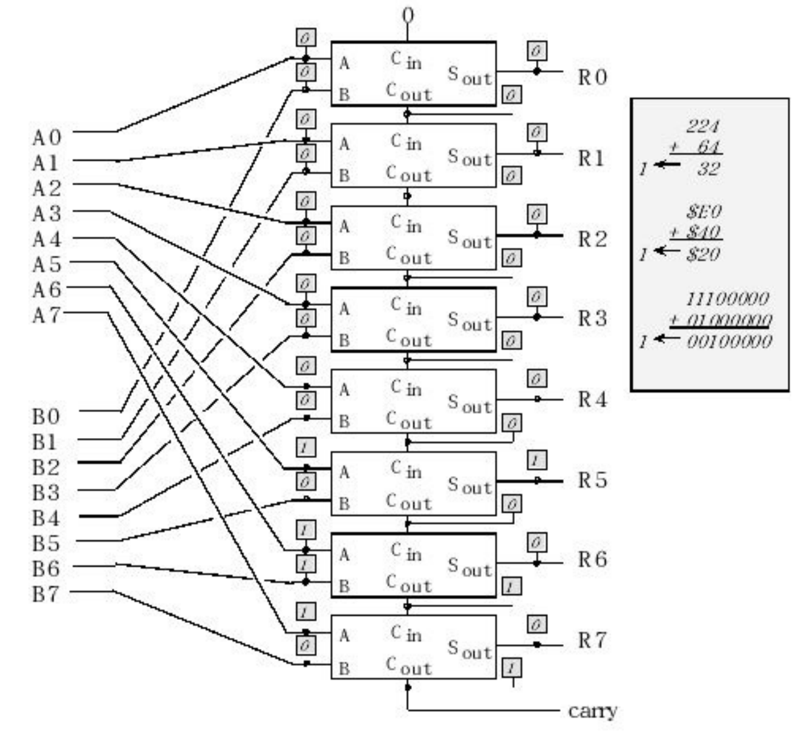
    Similarly, we build a 32-bit adder by cascading 32 binary full adders together. 
    The carry into the 32-bit adder is zero, and the carry out will be saved in the carry bit.
    To calculate the negative of a two’s complement number, we complement all of the bits and add 1.
        Using this fact, we can build an 8-bit subtractor (R=A-B) by first negating B, then using eight binary full adders to add A plus -B.
        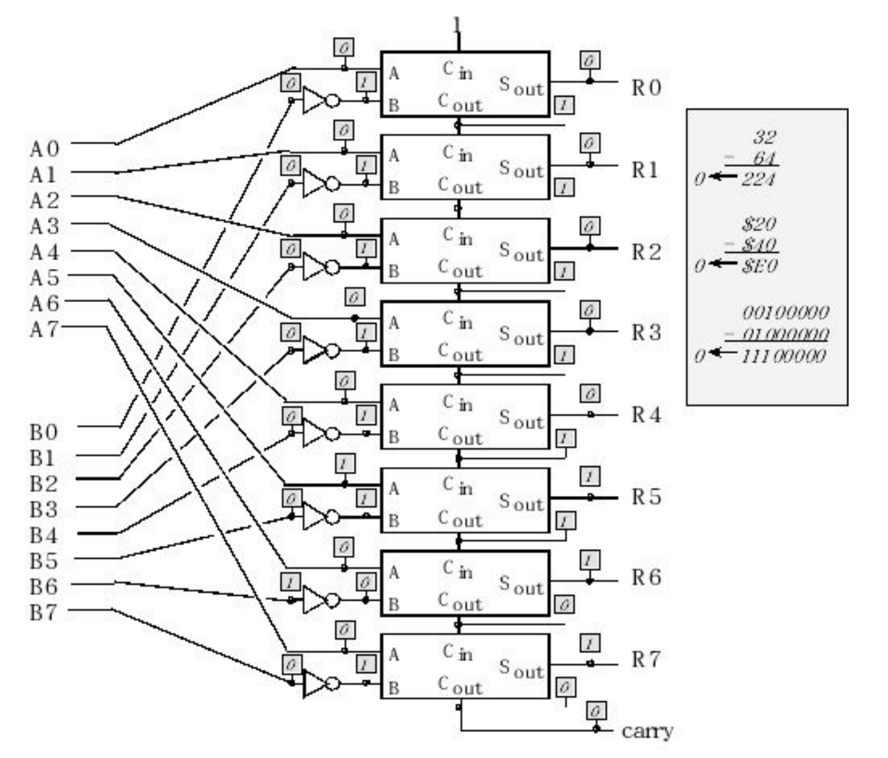
        The carry into the 8-bit adder is one, and the carry out is saved in the carry bit.
        Observation: The carry bit, C, is set after an unsigned addition when the result is incorrect. 
            The carry bit, C, is cleared after an unsigned subtraction when the result is
incorrect.
For an 8-bit signed number,
     The meanings of the numbers with bit 7=1 are different from unsigned, but we add and subtract signed numbers on the number wheel in a similar way 
     Therefore, we can use the same hardware to add and subtract two’s complement signed numbers. 
     The only difference is the carry out generated by the circuits do not represent an error when adding or subtracting two’s complement signed numbers.
     Instead a new bit, called overflow or V, will be calculated to signify errors when operating on signed numbers.
     Observation: The overflow bit, V, is set after a signed addition or subtraction when the result is incorrect.

ADD{S}{cond} {Rd,} Rn, <op2>    ;Rd = Rn + op2
ADD{S}{cond} {Rd,} Rn, #im12    ;Rd = Rn + im12
SUB{S}{cond} {Rd,} Rn, <op2>    ;Rd = Rn - op2
SUB{S}{cond} {Rd,} Rn, #im12    ;Rd = Rn - im12
RSB{S}{cond} {Rd,} Rn, <op2>    ;Rd = op2 - Rn
RSB{S}{cond} {Rd,} Rn, #im12    ;Rd = im12 - Rn
CMP{cond} Rn, <op2>             ;Rn - op2
CMN{cond} Rn, <op2>             ;Rn - (-op2)
The compare instructions CMP and CMN do not save the result of the subtraction or addition but always set the condition code.
The compare instructions are used to create conditional execution, such as if-then, for loops, and while loops.
The compiler may use RSB or CMN to optimize execution speed.
If the optional S suffix is present, addition and subtraction set the condition code bits as shown. 
    Bit         Name        Meaning after addition or subtraction
    N           Negative    Result is negative
    Z           Zero        Result is zero
    V           Overflow    Signed overflow
    C           Carry       Unsigned overflow
The addition and subtraction instructions work for both signed and unsigned values. 
    As designers, we must know in advance whether we have signed or unsigned numbers. 
    The computer cannot tell from the binary which type it is, so it sets both C and V. 
    Our job as programmers is to look at the C bit if the values are unsigned and look at the V bit if the values are signed.
    If the two inputs to an addition operation are considered as unsigned, then the C bit (carry) will be set if the result does not fit. In other words, after an unsigned addition, the C bit is set if the answer is wrong. 
    If the two inputs to a subtraction operation are considered as unsigned, then the C bit (carry) will be clear if the result does not fit. 
    If the two inputs to an addition or subtraction operation are considered as signed, then the V bit (overflow) will be set if the result does not fit. In other words, after a signed addition, the V bit is set if the answer is wrong. 
    If the result is unsigned, the N=1 means the result is greater than or equal to 2 ^ 31 . 
    Conversely, if the result is signed, the N=1 means the result is negative.
Observation: Microcomputers have two sets of conditional branch instructions (if statements) that make program decisions based on either the C or V bit.
Observation: Notice the C compiler uses the same + operator for 8-bit, 16-bit or 32- bit variables. Similarly, it will implement the appropriate operations for signed or unsigned numbers.

There are two appropriate mechanisms to deal with the potential for arithmetic errors when adding and subtracting. 
    The first mechanism, used by most compilers, is called promotion. 
        Promotion involves increasing the precision of the input numbers, and performing the operation at that higher precision. 
        An error can still occur if the result is stored back into the smaller precision.
        Fortunately, the program has the ability to test the intermediate result to see if it will fit into the smaller precision.
        In C, if we load a lower precision number into a higher precision variable, it will automatically promote. 
            Unsigned promotion occurs moving an uint8_t value into an uint_32 register or variable, and signed promotion occurs when moving from int8_t to int_32 . 
            No error occurs on promotion. 
            However, if we load a higher precision number into a lower precision variable, it will automatically demote. 
                For example writing a 32-bit uint32_t value into an 8-bit uint_8 variable will discard the top 24 bits. 
                Error can occur on demotion if the result does not fit. 
        Observation: When performing calculations on 8-bit or 16-bit numbers, most C compilers for the Cortex-M processor will first promote to 32 bits, perform the operations using 32-bit operations, and then demote the result back to the original precision.
        Common Error: Even though most C compilers automatically promote to a higher precision during the intermediate calculations, they do not check for overflow when demoting the result back to the original format.
        To promote a signed number, we duplicate the sign bit (called sign extension) as we add binary digits to the left side.
        when the result was too big the software set the result to maximum, and when the answer was too small the software set the result to minimum. We call this error handling technique ceiling and floor. 
        ARM calls this mechanism saturationand is implemented with the SSAT and USAT instructions.
        There are no mechanisms in C to access the condition code bits of the processor. 
        So, implementation of this approach must be performed in assembly language.
        eg:
            ;adds two unsigned 8-bit numbers, when the result was too big the software set the result to maximum
            Assume A , B ,and R are three 32-bit (4-byte) global variables defined in RAM.
            LDR R2, =A                  ; R2 = &A (pointer to A)
            LDR R3, =B                  ; R3 = &B (pointer to B)
            LDR R4, =R                  ; R4 = &R (pointer to R)
            LDR R0, [R2]                ; R0 = A
            LDR R1, [R3]                ; R1 = B
            ADDS R0, R0, R1             ; R0 = A+B
            BCC ok1                     ; if C==0, no error
            err1 MOV R0, #0xFFFFFFFF    ; ceiling, R0 = 4,294,967,295
            ok1 STR R0, [R4]            ; R = A+B
            ;assembly language subtracts two unsigned 32-bit numbers, when the answer was too small the software set the result to minimum.
            LDR R2, =A                  ; R2 = &A (pointer to A)
            LDR R3, =B                  ; R3 = &B (pointer to B)
            LDR R4, =R                  ; R4 = &R (pointer to R)
            LDR R0, [R2]                ; R0 = A
            LDR R1, [R3]                ; R1 = B
            SUBS R0, R0, R1             ; R0 = A-B
            BCS ok2                     ; if C==1, no error
            err2 MOV R0, #0             ; floor, R0 = 0
            ok2 STR R0, [R4]            ; R = A-B
            ;adds two signed 32-bit numbers, using the ceiling and floor algorithm
            LDR R2, =A                  ; R2 = &A (pointer to A)
            LDR R3, =B                  ; R3 = &B (pointer to B)
            LDR R4, =R                  ; R4 = &R (pointer to R)
            LDR R0, [R2]                ; R0 = A
            LDR R1, [R3]                ; R1 = B
            ADDS R0, R0, R1             ; R0 = A+B
            BVC ok3                     ; if V==0, skip to the end
            err3 MOV R0, #0x7FFFFFFF    ; R0 = 2,147,483,647
            BMI ok3                     ; if N==1, it was overflow
            under3 MOV R0, #0x80000000  ; R0 = -2,147,483,648
            ok3 STR R0, [R4]            ; R = A+B

Multiplication and division occurring in computers utilize a variety of complex algorithms to reduce power and minimize execution time.
    However, to illustrate binary multiplication we will present a very simple 8-bit unsigned algorithm, which uses a combination of shift and addition operations.
    In general, an n-bit number multiplied by an m-bit number yields an (n+m)-bit product.
        First, we define one of the multiplicands in terms of its basis representation.
        B = 128•b7 + 64•b6 + 32•b5 + 16•b4 + 8•b3 + 4•b2 + 2•b1 + b0
        Next, we distribute multiplication over addition
        R = A•128•b7 + A•64•b6 + A•32•b5 + A•16•b4 + A•8•b3 + A•4•b2 + A•2•b1 + A•b0
        We can simplify the equation leaving only one-bit shifts
        R = 2•(2•(2•(2•(2•(2•(2• A•b7+ A•b6)+ A•b5)+ A•b4)+ A•b3)+ A•b2)+ A•b1)+ A•b0
        The multiplication by a power of 2 is a logical shift left, and the multiplication by a binary bit (0 or 1) is an add or no-add conditional.
    
MUL{S}{cond} {Rd,} Rn, Rm   ;Rd = Rn * Rm
MLA{cond} Rd, Rn, Rm, Ra    ;Rd = Ra + Rn*Rm
MLS{cond} Rd, Rn, Rm, Ra    ;Rd = Ra - Rn*Rm
UDIV{cond} {Rd,} Rn, Rm     ;Rd = Rn/Rm unsigned
SDIV{cond} {Rd,} Rn, Rm     ;Rd = Rn/Rm signed
    These three multiply instructions only save the bottom 32 bits of the result. 
    They can be used for either signed or unsigned numbers, but no overflow flags are generated.
    If the S suffix is added to MUL , then the Z and N bits are set according to the result. 
    The division instructions do not set condition code flags and will round towards zero if the division does not evenly divide into an integer quotient.

UMULL{cond} RdLo, RdHi, Rn, Rm      ;Rd = Rn * Rm
SMULL{cond} RdLo, RdHi, Rn, Rm      ;Rd = Rn * Rm
UMLAL{cond} RdLo, RdHi, Rn, Rm      ;Rd = Rd + Rn*Rm
SMLAL{cond} RdLo, RdHi, Rn, Rm      ;Rd = Rd + Rn*Rm
    The following four multiply instructions use 32-bit operands and produce a 64-bitresult. 
    The two registers RdLo and RdHi contain the least significant and most significant parts respectively of the 64-bit result, signified as Rd . 
    These multiply instructions do not set condition code flags.

Stack
    The stack is a last-in-first-out temporary storage. 
    To create a stack, a block of RAM is allocated for this temporary storage.
    The stack pointer (SP) points to the 32-bit data on the top of the stack. 
    The stack grows downwards in memory as we push data on to it so, although we refer to the most recent item as the “top of the stack” it is actually the item stored at the lowest address! 
    To push data on the stack, the stack pointer is first decremented by 4, and then the 32-bit information is stored at the address specified by SP. 
    To pop data from the stack, the 32-bit information pointed to by SP is first retrieved, and then the stack pointer is incremented by 4. 
    The boxes in Figure represent 32-bit storage elements in RAM. 
    eg:
        PUSH {R0}
        PUSH {R1}
        PUSH {R2}
        POP {R3}
        POP {R4}
        POP {R5}
    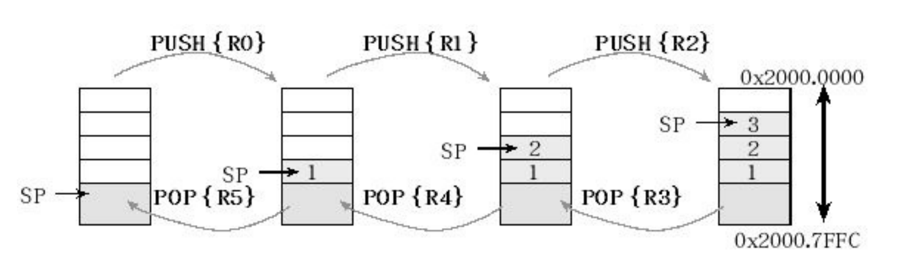
    Here are the rules one has to follow when using the stack:
        1. Functions should have an equal number of pushes and pops
        2. Stack accesses (push or pop) should not be performed outside the allocated area
              Overflow occurs when the number of elements becomes larger than the allocated space. 
              Stack underflow is caused when there are more pops than pushes, and it is always the result of a software bug.
              A stack overflow can be caused by two reasons. 
                    If the software mistakenly pushes more than it pops, then the stack pointer will eventually overflow its bounds. 
                    The processor will generate a bus fault when the software tries read from or write to an address that doesn’t exist. 
        3. Stack reads and writes should not be performed within the free area
        4. Stack push should first decrement SP, then store the data
        5. Stack pop should first read the data, and then increment SP
    Executing an interrupt service routine will automatically push information on the stack. 
        Since interrupts are triggered by hardware events, exactly when they occur is not under software control. 

Functions and Control Flow
    Normally the computer executes one instruction after another in a linear fashion. 
    In particular, the next instruction to execute is found immediately following the current instruction.
    More specifically, we use branch instructions to deviate from this straight line path.
    In this section, we will use the conditional branch instruction to implement if-then, whileloop, and for-loop control structures.
        B{cond} label       ;branch to label
        BX{cond} Rm         ;branch indirect to location specified by Rm
        BL{cond} label      ;branch to subroutine at label
        BLX{cond} Rm        ;branch to subroutine indirect specified by Rm
    Subroutines, procedures, and functions are code sequences that can be called to perform specific tasks. 
        They are important conceptual tools because they allow us to develop modular software.
    Object-oriented programming languages use the term method to describe subprograms that are part of objects;
    Modular programming allows us to build complex systems using simple components.
    The last instruction in a subroutine will be BX LR , which we use to return from the subroutine.
    In assembly language, we will use the BL instruction to call this subroutine.
        At run time, the BL instruction will save the return address in the LR register. 
        The return address is the location of the instruction immediately after the BL instruction. 
        At the end of the subroutine, the BX LR instruction will retrieve the return address from the LR register, returning the program to the place from which the subroutine was called. More precisely, it returns to the instruction immediately after the instruction that performed the subroutine call.
    In C, input parameters, if any, are passed in R0–R3. 
        If there are more than 4 input parameters, they are pushed on the stack. 
        The output parameter, if needed, is returned in R0.
    eg:
    Change
        LDR R1,=Num     ; 5) R1 = &Num             uint32_t Num;
        LDR R0,[R1]     ; 6) R0 = Num              void Change(void){
        ADD R0,R0,#25   ; 7) R0 = Num+25               Num = Num+25;
        STR R0,[R1]     ; 8) Num = Num+25          } 
        BX LR           ; 9) return                                
    main                                           void main(void){
        LDR R1,=Num     ; 1) R1 = &Num                 Num = 0;
        MOV R0,#0       ; 2) R0 = 0                             
        STR R0,[R1]     ; 3) Num = 0                                
    loop                                                
        BL Change  ; 4) function call                   while(1){      
        B loop          ; 10) repeat                        Change();
                                                        }
                                                    }
    Recall that all object code is halfword aligned, meaning bit 0 of the PC is always clear.
    When the BL instruction is executed, bits 31–1 of register LR are loaded with the address of the instruction after the BL , and bit 0 is set to one. 
    When the BX LR instruction is executed, bits 31–1 of register LR are put back into the PC, and bit 0 of LR goes into the T bit. 
        On the ARM ® Cortex™-M processor, the T bit should always be 1, meaning the processor is always in the Thumb state. 
        Normally, the proper value of bit 0 of the LR is assigned automaticallyby the BL instruction.
    It takes three steps to perform a comparison. 
        We begin by reading the first value into a register.
        The second step is to compare the first value with the second value. We can use either a subtract instruction ( SUBS ) or a compare instruction ( CMP ). These instructions set the condition code bits. 
        The last step is a conditional branch. 
    eg:
        ;an if-then structure involving testing for unsigned greater than or equal to.
        ;Since the variable is unsigned, we use an unsigned conditional.
    Change
        LDR R1,=Num     ; R1 = &Num                 uint32_t Num;
        LDR R0,[R1]     ; R0 = Num                  void Change(void){
        CMP R0,#25600                                   if(Num < 25600){
        BHS skip                                            Num = Num+1;
        ADD R0,R0,#1    ; R0 = Num+1                    }
        STR R0,[R1]     ; Num = Num+1                
    skip
        BX LR           ; return                    }
    eg:
        ;an if-then-else structure involving signed numbers.
        ; Since the variable is signed, we use asigned conditional.
    Change
        LDR R1,=Num     ; R1 = &Num                 int32_t Num;
        LDR R0,[R1]     ; R0 = Num                  void Change(void){
        CMP R0,#100                                     if(Num < 100){
        BGE else                                            Num = Num+1;
        ADD R0,R0,#1    ; R0 = Num+1
        B skip                                          }
    else                                                else{
        MOV R0,#-100    ; -100                              Num -= 100;
    skip
        STR R0,[R1]     ; update Num                    }
        BX LR           ; return                    }

Assembler Directives
    We use assembler directives to assist and control the assembly process. 
    Directives or pseudo-ops are not part of the instruction set. 
    These directives change the way the code is assembled.
        The first batch defines where and how the objects (code and variables) are placed in memory. 
            CODE is the place for machine instructions, typically ROM. 
            DATA is the place for global variables, typically RAM. 
            STACK is the place for the stack, also in RAM. 
            The ALIGN=n modifier starts the area aligned to 2 n bytes. 
            |.text| is used for code sections produced by the C compiler, or for code sections otherwise associated with the C library. 
                Using |.text| makes this assembly code callable from C.
            Normally RAM areas are initialized to zero, but NOINIT defines a RAM area that is not initialized. 
            The fact that ROM begins at 0x0000.0000 and RAM begins at 0x2000.0000 is specified in the Project->Options, Linker tab.
    AREA RESET,CODE,READONLY                ;reset vectors in flash ROM
    AREA DATA                               ;places objects in data memory (RAM)
    AREA |.text|,CODE,READONLY,ALIGN=2      ;code in flash ROM
    AREA STACK,NOINIT,READWRITE,ALIGN=3     ;stack area
    The next two directives are used to link between files. 
        Normally labels in one file are not accessiblein another file. 
        If we have a global object (function or variable) we add an EXPORT directive in the file where the object is defined and an IMPORT directive in the file wishing to access the object. 
        We can EXPORT a function in an assembly file, and call that function from a C file. 
        Similarly, we can define a function in a C file, and IMPORT the function into an assembly file. 
        GLOBAL is a synonym for EXPORT .
    IMPORT name     ;imports function “name” from other file
    EXPORT name     ;exports public function “name” for use elsewhere
    The ALIGN directiveis used to ensure the next object is aligned properly.
        For example, machine instructions must be half-word aligned, 32-bit data accessed with LDR STR must be word-aligned. 
        Nice programmers place an ALIGN at the end of each file so the start of every file is automatically aligned.
    ALIGN       ;skips 0 to 3 bytes to make next word aligned
    ALIGN 2     ;skips 0 or 1 byte to make next halfword aligned
    ALIGN 4     ;skips 0 to 3 bytes to make next word aligned
    The THUMB directive is placed at the top of the file to specify code is generated with Thumb instructions. 
    We place an END directive at the end of each file.
    THUMB       ;uses Thumb instructions
    END
    The following directives can add variables and constants.
    DCB expr{,expr}     ;places 8-bit byte(s) into memory
    DCW expr{,expr}     ;places 16-bit halfword(s) into memory
    DCD expr{,expr}     ;places 32-bit word(s) into memory
    SPACE size          ;reserves size bytes, unitialized
    The EQU directive gives a symbolic name to a numeric constant, a register-relative value or a program-relative value. 
        We will use EQU to define I/O port addresses.
    GPIO_PORTD_DATA_R   EQU     0x400073FC
    GPIO_PORTD_DIR_R    EQU     0x40007400
    GPIO_PORTD_DEN_R    EQU     0x4000751C
First Example Project
    Every ARM Keil™uVision® project will have a file named Startup.s .
        CCStudio projects will have a similar file. 
    There will be small differences between the file we use for assembly and the one we use for C, but basically this file will contain the following components:
        Defines the size of the stack
        Defines the size of the heap (which we will not use)
        Defines the reset vector and all the interrupt vectors
        The reset handler that jumps to your code
            The reset handler is code that is run when the reset button is pushed or on power up.
            The reset handler initializes global variables by branching to the __main function, which in turn, calls your main() function.
            If you are writing C code, you will not need to edit the Startup.sfile. 
            For assembly, you will have to replace the branch to __main with a branch to your application code.
                The assembly examples with this book all use Start as the user code to be run on reset.
        Default interrupt service routines that do nothing
        Defines some functions for enabling and disabling interrupts
        eg:
            ;implements a pseudo random number generator using a linear congruential generator (LCG).
            ;M_{n+1} = (a * M_{n} + c) mod n
            ;The AREA DATA directive specifies the following lines are placed in data space (typically RAM). 
            ;The MSPACE 4 allocates four uninitialized bytes, which is one 32- bit word. 
            ;The AREA CODE directive specifies the following lines are placed in code space (typically ROM). 
            ;The |.text| connects this program to the C code generated by the compiler, which we need if linking assembly code to C code. 
            ;ALIGN=2 will force the machine code to be word-aligned as required. 
            ;In assembly, the registers are used for storing temporary information. 
            ;The LDR R4,=M instruction establishes R4 as a pointer to the variable M . 
            ;When the function is called the return address is saved in LR. 
            ;Register R0 has the return parameter, which is a new random number. 
            ;The BX LR is the return from subroutine instruction (moves LR back to PC) making the PC point to the B loop instruction.
            THUMB                                                       // C implementation
            AREA DATA, ALIGN=2              
            EXPORT M [DATA,SIZE=4]
            M SPACE 4                                                   uint32_t M;
            AREA DATA, ALIGN=2                                          // Random number generator
            AREA |.text|,CODE,READONLY,ALIGN=2                          // from Numerical Recipes by Press et al.
            EXPORT Start
        Start                                                           void main(void){
            LDR R2,=M                       ; R2 = &M                       uint32_t n;
            MOV R0,#1                       ; Initial seed                  M = 1; // seed
            STR R0,[R2]                     ; M=1
        loop                                                                while(1){
            BL Random                                                           n = Random();
            B loop                                                          }
            ; Return R0= random number generator                         }   
            ; Linear congruential generator
        Random                                                           uint32_t Random(void){
            LDR R2,=M                       ; R2 = &M
            LDR R0,[R2]                     ; R0 = M
            LDR R1,=1664525
            MUL R0,R0,R1                    ; R0 = 1664525*M
            LDR R1,=1013904223
            ADD R0,R0,R1                    ; 1664525*M+1013904223              M = 1664525*M +1013904223;
            STR R0,[R2]                     ; store M                           return(M);
            BX LR                                                        }
            ALIGN
            END
    If we are in the main program, we can use any register we need. 
    However, by AAPCS convention functions only freely modify registers R0–R3 and R12. 
        If a function needs to use R4 through R11, it is best to push the current register value onto the stack, use the register, and then pop the old value off the stack before returning. 
        In order to preserve an 8-byte stack alignment, AAPCS requires us to push and pop an even number of registers. 
        If function calls are nested (one subroutine calls another subroutine) then the LR must be saved on the stack.
    Sometimes we wish to write functions in assembly and call them from C.
        By the AAPCS convention, the first parameter is passed in Register R0. 
        We export the function name in the assembly file, and create a prototype for the function in the C file.
        For C to access an assembly variable, we export it in the assembly file, and add an extern statement it in the C file
            THUMB                                                         // C calls assembly                 
            AREA DATA, ALIGN=2                                            uint32_t Random(void);
            M SPACE 4                                                     extern uint32_t M;          
            AREA |.text|,CODE,READONLY,ALIGN=2                                                                   
            EXPORT Random                                                  void main(void){      
            EXPORT M                                                           uint32_t n;
            ; Return R0= random number generator                               M = 1; // seed     
            ; Linear congruential generator                                    while(1){
        Random                                                                     n = Random();                    
            LDR R2,=M                       ; R2 = &M
            LDR R0,[R2]                     ; R0 = M                           }
            LDR R1,=1664525                                                 }
            MUL R0,R0,R1                    ; R0 = 1664525*M
            LDR R1,=1013904223
            ADD R0,R0,R1                    ; 1664525*M+1013904223                                        
            STR R0,[R2]                     ; store M                                     
            BX LR                                                         
            ALIGN
            END
    Conversely, sometimes we wish to write functions in C and access them from assembly. 
        Again, the first parameter is passed in Register R0. 
        We import the function name and import the variable in the assembly file. 
        Notice that C functions and variables have explicitly defined types, whereas the type for assembly functions and variables is specified in how it is used.
        THUMB
        IMPORT Random                                       uint32_t M; // Random number generator
        IMPORT M                                                        // from Numerical Recipes by Press et al.
        AREA |.text|,CODE,READONLY,ALIGN=2
        EXPORT Start
    Start                                                   uint32_t Random(void){
        LDR R2,=M               ; R2 = &M                       M = 1664525*M +1013904223;
        MOV R0,#1               ; Initial seed                  return(M);
        STR R0,[R2]             ; M=1                       }
    loop 
        BL Random
        B loop
        ALIGN

Simplified Machine Language Execution
    The purpose of considering a simplified version is to understand in general how a computer executes instructions without being burdened with the extreme complexities that exist in today’s high-speed processors. 
    The major differences between the real ARM ® Cortex™-M processor and the simplified processor are shown in Table.
        Actual ARM® Cortex™-M processor                 Simplified processor
        Sometimes 8-, 16-, 32-bit access                All opcode accesses are aligned 16-bit
        Special case for unaligned access               All data accesses are aligned 32-bit
        Instruction queue enhances speed                Simple fetch-execute sequence
        Fetches op codes for later execution            Fetches op codes for immediate execution
        Fetches op codes that are never executed        Fetched op codes are always executed
        Five buses with simultaneous accessing          One shared bus
        Harvard architecture                            Von Neumann architecture
    This simple processor has four major components, as illustrated
    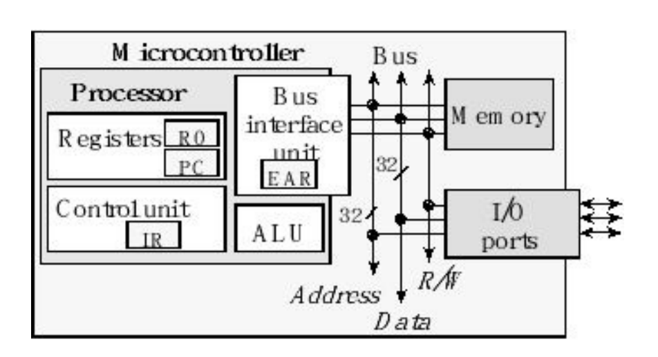
        The control unit (CU) orchestrates the sequence of operations in the processor.
            The CU issues commands to the other three components.
        The instruction register (IR) contains the op code for the current instruction.
            Most op codes on the Cortex™-M processor are 32 bits wide, but some are 16 bits.
        The arithmetic logic unit (ALU) performs arithmetic operations such as addition, subtraction, multiplication and division.  
            The ALU also performs logical operations such as and, or, and shift. 
        The program counter (PC) points to the memory containing the instruction to execute next. 
        The bus interface unit (BIU) reads data from the bus during a read cycle, and writes data onto the bus during a write cycle. 
            The effective address register (EAR) contains the data address corresponding to an operand in the current instruction. 
            This address could be a source or destination address depending on whether the operation is a read or write respectively.
        This simplified bus contains 32 address lines, 32 data lines, and an R/W signal. 
        There are two types of bus cycles that the processor uses to communicate with memory. 
            For both types of cycles, the processor drives the address bus and the R/W signal. 
            The 32-bit address bus selects which memory location (or I/O device) to access. 
            The R/W signal specifies read or write. 
            During a read cycle (R/W=1), the memory at the specified address puts the information on the data bus, and the processor transfers the information (32 bits in this simplified simulation) into the appropriate place within the processor. 
            The processor has three types of read cycles:
                Instruction fetch. The address is the PC and the 32-bit data is loaded into the instruction register, IR. The PC is incremented by 2 or by 4.
                Data fetch. The address is the EAR, and the 32-bit data is loaded into a register or sent to the ALU.
                Stack pop. First, the 32-bit data is read from memory pointed to by SP and stored in a register, then the stack pointer is incremented SP=SP+4
            During a write cycle (R/W=0), the processor puts the 32-bit information on the data bus, and the memory transfers the information into the specified location. 
            The write cycles can be grouped into two types:
                Data write. The 32-bit data from a register is stored in memory at the address specified by the EAR.
                Stack push. First, the stack pointer is decremented SP=SP-4, then the 32- bit data from a register is stored in memory at the address specified by the SP.
    In general, the execution of an instruction goes through many phases. 
        First, the computer fetches the machine code for the instruction by reading the value in memory pointed to by the program counter (PC). 
        After each word of the instruction is fetched, the PC is incremented by 2 or 4 (depending on the size of the instruction). 
        During phases 2 and 3, the instruction is decoded, and the effective address is determined (EAR). 
            The load and pop instructions require additional data, and 
        during phase 4 the data is retrieved from memory at the effective address. 
        During phase 5, the actual function for this instruction is performed. 
            Sometimes the computer bus is idle at this time, because no additional data is required. 
        The store and push instructions require date to be written back to memory. 
        The simplified execution has six phases, but in this discussion we will focus only on those phases that generate bus cycles (shown in bold):
        Phase       Function            R/W         Address         Comment
        1           Op code fetch       read        PC              Put op code into IR
        2           Decode instruction  none                        Increment PC by 2 or by 4
        3           Evaluation address  none                        Determine EAR
        4           Data read           read        SP,EAR          Data passes through ALU,
        5           Free cycle                                      ALU operations
        6           Data store          write       SP,EAR          Results stored in memory
        Phase 1. Opcode fetch. 
            The execution begins with fetching the entire op code and putting it in the IR. 
            The PC is incremented by 2 or 4 after fetching the op code.
        Phase 2. Decode instruction. 
            The op code will tell the control unit exactly what steps need to be performed to execute the instruction. 
            This phase happens so quickly that bus cycles are not needed.
        Phase 3. Evaluate address. 
            During this phase, the processor will set the EAR to point to the address where memory is to be accessed. 
            Usually, this phase does not require any bus cycles.
        Phase 4. Data read. 
            The load and pop instructions require data from memory. 
            These instructions will use the EAR to read data from memory as needed. 
            It takes a bus cycle to read data from memory, but since registers are inside the processor, no bus cycles occur as data is saved into a register. 
            Remember registers do not have addresses, and see in Figure that registers are not attached to the bus.
        Phase 5. Free cycles. 
            Any ALU functions occur next. 
            On a real microcontroller the ALU requires time to execute, but the simplified cycle-by-cycle simulation does not account for these do-nothing cycles.
        Phase 6. Data write. 
            The store and push instructions require writing data to memory.
            The address of these writes is determined by the EAR.

        0x000001BA      4906        LDR r1, [pc,#24]   ;Change      AREA DATA, ALIGN=2
        0x000001BC      6808        LDR r0, [r1,#0x00]              Num SPACE 4
        0x000001BE      F1000019    ADD r0,r0,#0x19                 AREA CODE,READONLY,ALIGN=2
        0x000001C2      6008        STR r0, [r1,#0x00]              THUMB
        0x000001C4      4770        BX lr                           EXPORT Start
                                                                    Change 
        0x000001C6      4903        LDR r1, [pc,#12]    ;Main           LDR R1,=Num     ; 5)
        0x000001C8      F04F0000    MOV r0,#0x00                        LDR R0,[R1]     ; 6)
        0x000001CC      6008        STR r0, [r1,#0x00]                  ADD R0,R0,#25   ; 7)
        0x000001CE      F7FFFFF4    BL.W 0x000001BA                     STR R0,[R1]     ; 8)               
        0x000001D2      E7FC        B 0x000001CE                        BX LR           ; 9)            
                                                                    Start 
        0x000001D4      20000000    ; 数据段Num的地址                   LDR R1,=Num     ; 1)
                                                                        MOV R0,#0       ; 2)
                                                                        STR R0,[R1]     ; 3)
                                                                        loop BL Change  ; 4)
                                                                        B loop          ; 10)

        R/W     Address         Data        Operations                      Instruction
        Read    0x000001C6      0x4903      1) PC=0x000001C8                LDR R1,=Num
        Read    0x000001D4      0x20000000  R1=0x20000000
        Read    0x000001C8      0xF04F0000  2) PC=0x000001CC,R0=0           MOV R0,#0
        Read    0x000001CC      0x6008      3) PC=0x000001CE                STR R0,[R1]
        Write   0x20000000      0x00000000  Num=0
        Read    0x000001CE      0xF7FFFFF4  4) LR=0x000001D3,PC=0x000001BA  BL Change
        Read    0x000001BA      0x4906      5) PC=0x000001BC                LDR R1,=Num
        Read    0x000001D4      0x20000000  R1=0x20000000
        Read    0x000001BC      0x6808      6) PC=0x000001BE                LDR R0,[R1]
        Read    0x20000000      0x00000000  R0=0
        Read    0x000001BE      0xF1000019  7) PC=0x000001C2,R0=25          ADD R0,R0,#25
        Read    0x000001C2      0x6008      8) PC=0x000001C4                STR R0,[R1]
        Write   0x20000000      0x00000019  Num=25
        Read    0x000001C4      0x4770      9) LR=0x000001D2                BX LR
        Read    0x000001D2      0xE7FC      10) PC=0x000001CE               B Loop

CISC versus RISC
    There are two classifications of processors: complex instruction set computer (CISC) and reduced instruction set computer (RISC).
    CISC                                                                RISC
    Many instructions Few instructions                                  Instructions have varying lengths Instructions have fixed lengths
    Instructions execute in varying times                               Instructions execute in 1 or 2 bus cycles
    Many instructions can access memory                                 Few instructions (e.g., load and store) can access memory
    In one instruction, the processor can both read and write memory    No one instruction can both read and write memory in the same instruction
    Fewer and more specialized registers.                               Many identical general purpose registers
        E.g., some registers contain data, others contain addresses 
    Many different types of addressing modes                            Limited number of addressing modes. 
                                                                            E.g., Thumb has register, immediate, and indexed.
    RISC computers can be designed for low power because of the simplicity of the architecture (e.g., MSP430).

Details Not Covered in this Book
    Actually, there are two stack pointers: the main stack pointer (MSP) and the process stack pointer (PSP). 
        Only one stack pointer is active at a time. 
        In a high-reliability operating system, we could activate the PSP for user software and the MSP for operating system software. 
        This way the user program could crash without disturbing the operating system. 
        Because of the simple and dedicated nature of the embedded systems developed in this book, we will exclusively use the main stack pointer.
    The ARM ® Cortex™-M processor has two privilege levels called privileged and unprivileged. 
        Bit 0 of the CONTROL register is the thread mode privilege level (TPL). 
        If TPL is 1 the processor level is privileged. 
        If the bit is 0, then processor level is unprivileged. 
            Running at the unprivileged level prevents access to various features, including the system timer and the interrupt controller. 
        Bit 1 of the CONTROL register is the active stack pointer selection (ASPSEL). 
            If ASPSEL is 1, the processor uses the PSP for its stack pointer. 
            If ASPSEL is 0, the MSP is used. 
            When designing a highreliability operating system, we will run the user code at an unprivileged level using the PSP and the OS code at the privileged level using the MSP.
    In this book we will not consider the Q bit, which isthe sticky saturation flag and is set by the SSAT and USAT instructions. 
    The ICI/IT bits are used by interrupts and by the IF-THEN instructions.
    The ARM ® Cortex™-M processor uses bit-banding to allow read/write access to individual bits in RAM and some bits in the I/O space. 
    For more information on bitbanding, refer to Chapter 2 of Volume 2. 
        We will see an alternative way to access GPIO pins on the Texas Instruments microcontrollers in the next chapter called bitspecific addressing.
    If-then-else control structures are commonly found in computer software. If the BHI in Program 3.10or the BGE in Program 3.11 were to branch, the instruction pipeline would have to be flushed and refilled. 
        In order to optimize execution speed for short ifthen and if-then-else control structures, the ARM ® Cortex™-M processor employs conditional execution. 
        There can be between one and four conditionally executed instructions following an IT instruction. 
        The syntax is 
            IT{x{y{z}}} cond
                where x y and z specify the existence of the optional second, third, or fourth conditional instruction respectively.
                For example IT has one conditional instruction, ITT has two conditional instructions, ITTT has three conditional instructions, and ITTTT has four conditional instructions.
                We can specify x y and z as T for execute if true or E for else.
                The conditional suffixes for the instructionsmust match the conditional field of the IT instruction. 
                    In particular, the conditional for the true instructions exactly match the conditional for the IT instruction. 
                    Furthermore, the else instructions must have the logical complement conditional. 
                    If the condition is true, the instruction is executed. 
                    If the condition is false, the instruction is fetched but not executed. 
